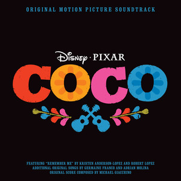
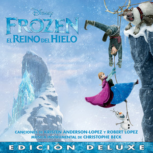

# Canciones

- [Canciones](#canciones)
- [Brave](#brave)
  - [Volaré](#volaré)
- [Vaiana](#vaiana)
  - [🎸 Que hay más allá](#-que-hay-más-allá)
  - [Un nuevo hogar](#un-nuevo-hogar)
  - [De nada](#de-nada)
  - [Brillante](#brillante)
- [Coco](#coco)
  - [Un poco loco](#un-poco-loco)
  - [El latido de mi corazón](#el-latido-de-mi-corazón)
  - [Recuérdame](#recuérdame)
- [Frozen](#frozen)
  - [Suéltalo](#suéltalo)
  - [Muéstrate](#muéstrate)
  - [Por primera vez en años](#por-primera-vez-en-años)
  - [Hazme un muñeco de nieve](#hazme-un-muñeco-de-nieve)
  - [Mucho más allá](#mucho-más-allá)
- [Toy story](#toy-story)
  - [Hay un amigo en mi](#hay-un-amigo-en-mi)

# Brave


<div style="page-break-after: always;"></div>

## Volaré

- Artista: Russian Red
- Álbum: Brave
- Fecha de lanzamiento: 2012
- Video: https://www.youtube.com/watch?v=Vy0VoyyxHEU

**Intro Violín**

``` 
| D   | D   | D   | C C C |
| D   | D   | D   | C C C |
| D   | D   | D   | C C C |
| Am  | Am  | Am  | Am    |
``` 
 
[Verse]

```
     D               G            D           G
Allá donde el viento habla y el cielo es más azul
     Bm    A     G              D            A
allá donde las estrellas te iluminan con su luz
```

**Estribillo**

``` 
    Bm7       G          D      A      Bm7
Correré, volaré, con el viento cabalgaré
     G           D     A     D
Volaré, con el viento cabalgaré
``` 


``` 
   D          G             D             A
Na-na   Na-na Na-na Na-na   Na Na   Na-na Na
   D          G             D             A
Na-na   Na-na Na-na Na-na   Na Na   Na-na Na
``` 
``` 
Bm (mantener) | A
``` 
 
[Verse]
``` 
  D                    G
Allá donde el bosque esconde
   D                   G
secretos que nunca sabrás
       Bm     A       G
las montañas se hacen eco
       D                 A
de historias de tiempo atrás
 
     D          G
Cruzaré ríos y valles
         D          G
y a las cumbres subiré
      Bm    A        G
seré fuerte como las rocas
        A        D
y orgullosa gritaré
``` 
 
**Estribillo**

``` 
    Bm7       G          D      A      Bm7
Correré, volaré, con el viento cabalgaré
     G           D     A     D
Volaré, con el viento cabalgaré
``` 
 
[Instrumental]
``` 
   D          G             D             A
Na-na   Na-na Na-na Na-na   Na Na   Na-na Na
   D          G             D             A
Na-na   Na-na Na-na Na-na   Na Na   Na-na Na
   D          G             D             A
Na-na   Na-na Na-na Na-na   Na Na   Na-na Na
``` 
 
[Outro]
``` 
D   G   D    G
D   G   D
```

<div style="page-break-after: always;"></div>

# Vaiana


<div style="page-break-after: always;"></div>

## 🎸 Que hay más allá

- Artista: María Parrado
- Película musical: Vaiana
- Fecha de lanzamiento: 2016

 | Tonalidad | Tempo  | Compás | Capo |
 | --------- | ------ | ------ | ---- |
 | Mi mayor  | 84 bpm | 4/4    | No   |


**Estrofa**
``` 
E                               B/F#                     C#m
He buscado siempre aquí una respuesta, Esperando en la orilla
                    Asus2
Y no sé muy bien por qué,
 E                         B/F#                       C#m         
Sólo quiero ser la hija perfecta, Pero regreso a la orilla, 
                      Asus2
no hay nada que pueda hacer.
```                     

 
[Bridge]
``` 
      C#m                           B/D#
Cada amanecer, cada sensación, Cada atardecer, al caer el sol,     
           E                                 Am6
Vuelvo a imaginar que hay algún lugar donde debo ir...
``` 
**Estribillo**
 ``` 
       E                                B/D#
Veo la línea entre el cielo y el mar en frente,
       C#m                 A
¿quién sabrá si hay más allá?
          E                         B/D#
Y si el viento que sopla de cola es fuerte
      C#m
Me llevará,
      Am6                         E
Si me voy un mundo nuevo descubriré.
```  
[Bridge]
```  
B C#m A
```  
**Estrofa**
``` 
                           B/D#                       C#m
Ya sé que aquí todos en la isla piensan que son muy felices,
                   A
Todos se dejan llevar,
E                             B/D#
Sé que todo el mundo en esta isla,
                  C#m
Tiene un sitio concreto,
             C#m/B  A
Todos tienen su lugar.
```  
[Bridge]
```  
      C#m
Puedo liberar, con fuerza y pasión,
       B/D#
Lo puedo intentar, seguiré en mi rol,
     E
Pero esa voz canta otra canción,
        Am        Am6
¿que me pasa a mí?
```  
**Estribillo**
```  
       E                                B/D#
Hoy la línea entre el cielo y el mar me ciega,
         C#m               A
¿quien sabrá si hay más allá?
    E                                  B/D#
Y parece llamarme desde allí con gran fuerza,
       C#m                       Am                Am6
Aquel lugar, que hay detrás del sol allí quiero ir yo.
 
       F                                  C
Hoy la línea entre el cielo y el mar me llama,
           Dm             A#
Y ¿quien sabrá, a donde irá?
          F                          C
Y si el viento que sopla de cola me lleva,
            Dm   Dm/C            G#
Sabré al final yo que hay más alláa
``` 

<div style="page-break-after: always;"></div>

## Un nuevo hogar

 | Tonalidad | Tempo   | Compás | Capo |
 | --------- | ------- | ------ | ---- |
 | La mayor  | 101 bpm | 4/4    | No   |

**Estrofa**
```  
A
Tatou o tagata folau e vala'auina
A
E le atua o le sami tele e o mai
D
Ia ava'e le lu'itau e lelei
E        A
Tapenapena
```  
**Estribillo**
```  
D
Aue, aue
A
Nuku I mua
E               A
Te manulele e tataki e
 
D
Aue, aue
A
Te fenua, te malie,
E
Nae ko hakilia mo kaiga e
```  
**Estrofa**
 ``` 
A
Sabemos el viento leer Con gran nitidez,
A
Surcamos el ancho mar Con facilidad,
D                     E                  A
Y cada estrella ahí está Justo en su lugar,
A
Sabemos mirar de verdad
 ``` 
**Estribillo**
```  
D
Aue, aue,
A
Vamos a donde hay
E                    A
Una isla nueva donde enraizar,
 
D
Aue, aue,
A
En nuestra mente la isla está,
E
Sabemos que está cerca
E
un nuevo hogar
 
D                      F#m
Aue, aue, No dejaremos nunca de explorar,
E
Las tradiciones transmitimos
E
En un ciclo sin final,
 
D
Aue, aue,
A
Te fenua, te mālie
E
Nā heko hakilia
E               A
Un nuevo hogar
``` 

<div style="page-break-after: always;"></div>

## De nada

 | Tonalidad | Tempo   | Compás | Capo |
 | --------- | ------- | ------ | ---- |
 | Fa mayor  | 135 bpm | 4/4    | No   |

**Verse**
 
```  
Jaja, vale vale
C          F/C
 Ya sé qué pasa aquí
A#                      C
 Se te hace raro la grandeza ver,
C            F/C
  Y no sabes bien qué sentir (adorable)
       A#                        C
Los humanos veo que nunca cambiaréis.
         C            F/C
Abre tus ojos, vamos ya;
           A#                   C
sí, asúmelo: soy Mauí de verdad.
             C                F/C
Admírame bien -qué bueno estoy-,
        A#              C
estás justo frente a un semidios.
```  
**Estribillo**
```  
Am            F            C
¿Qué puedo decir? Solo «de nada»
        E7               Am
por el cielo, el mar y el sol.
                F            C
No hay de qué, está bien, de nada;
     E7                    C
soy sólo un tipo cachas muy normal.
 ``` 
 
**Estrofa**
 ``` 
C                                F/C
¡Hey! ¿Quién levantó el cielo con su pulgar
                        A#
cuándo ni caminabais? ¡El menda!
C                  C
Cuándo el frío llegó,
                  F/C
¿quién piensas que el fuego robó?
       A#
¡Lo tienes delante!
 
C                           F/C
¡Oh! También cacé un día el sol–de nada-
          A#                    C
para darte luz y calor.
          C       F/C
El viento también domé –¡de nada!-
   A#           C
y así los barcos impulsé.
```  
 
**Estribillo**
```  
Am            F            C
¿Qué puedo decir? Solo «de nada»
        E7                  Am
por las islas que hice emerger
              F                  C
por las islas que hice emerger
         E7                     Am
para que podáis vivir –de nada-. ¡Ja
    F        C
¡De nada! De nada.
    C
de nada
 ``` 
[Rap]
 ``` 
Bien, piénsalo un poco...
C
Oye, puedo seguir y seguir aún más;
puedo explicar cada cosa desde el Big Bang:
C
las mareas, la hierba, la tierra...
fue sólo Mauí que estaba de fiesta.
C
Maté una anguila, su cuerpo enterré,
un árbol brotó y ahora cocos tenéis.
C
¿Cuál es el punto? Aprende la lección:
ojo con Mauí si ves que está en plena acción.
 
 
Am
Y el tapiz que he pintado en mi piel
F
es un mapa de lo que logré.
C
Míralo bien, hago que todo pase.
E7
Mira, aquí hay un mini-Mauí bailando claqué.
 
Ja, ja, ja, ja, ja, ja. ¡Ey!
```  
**Estribillo**
```  
Am          F              C
Deja que diga otra vez «de nada» (de nada)
           E7              Am
por crearos un mundo así.
                 F           C
No hay de qué, está bien, de nada (de nada).
    E7                     Am
Medítalo muy bien, te digo adiós.
 
          F            C
Te toca a ti decir «de nada» (de nada),
       E7             Am
pues en tu barco me voy.
             F          C
Muy lejos navegaré –de nada (de nada)-,
E7                            Am
todo menos flotar puedo hacer yo.
```  
[Outro]
```  
              F/C
(De nada) De nada
              C
(De nada) de nada
             C
Y gracias!
``` 

<div style="page-break-after: always;"></div>

## Brillante

 | Tonalidad | Tempo  | Compás | Capo |
 | --------- | ------ | ------ | ---- |
 | Do mayor  | 73 bpm | 4/4    | No   |

**Estrofa**
``` 
Em        Am
   Hace tiempo no tenía este
    Em    Am
glamour  Fui un cangrejito muy soso...
Em       Am
  Pero ahora estoy feliz y en
      Cm          Am7b5
plenitud, Porque soy muy bello, nena.
 
Em       Am
  Tu corazón tu abuela te hizo
     Em             Am
escuchar. Sé cómo eres por dentro.
Em         Am
  Ese argumento yo lo voy a
    Cm            Am7b5
desmontar, Ella mintió. Mejor ser:
```  
**Estribillo**
``` 
     G            C
¡Brillante! Cual tesoro de un navío que se
    G         C
hundió. La cubierta tengo
     G           C
¡Brillante! Igualito que un collar de un
    D
millón ¡Un segundo! ¿Sabes que...
 
 
Em                   C
...Los peces tontos son:
                          Em
Buscan siempre algo brillante.
      C    D
¡Principiantes!
Em                   C
Oh Y van sin ton ni son
                      Am
Hacia aquello más radiante.
           D
¡Mmm qué rico!
Eb
Ven, pescadito (pescadito)
Eb
con vestidito (¡pescadito!)
```
**Descanso**
```
 
¡Vaya, vaya,
Em       Am
vaya...! Maui tiene, con su aspecto, un
      Em           Am
problemín. Pequeño semi-mini-mini-dios.
Em                   Am
 ¡Auch! ¡Qué espectáculo terrible!¡Ven
 Cm               D
aquí! Vale. El anzuelo grande ya te
 
Em         Am
va. Sin embargo algo te he de
Em                    Am
agradecer, Y a los tatoos de tu cuerpo,
Em           Am
 Pues yo también de mí una obra de arte
  Cm            Am7b5
creé. ¿O no lo ves? Yo soy muy
``` 
**Estribillo**
```
 
      G           C
¡Brillante! Yo reluzco cual diamante o cual
   G       C        D
rubí, Soy así, un tipo
     G              C
¡Brillante! Ni un ejército me haría
     Am              D
sucumbir. Me basto a mí. Maui, tío...

Em               C
  Lo puedes intentar,
                    Am                    D
Pero nunca antes un semi-dios Ganó a un decápodo.¡Míralo!
Em              C
  Tú ahora morirás,
                  Am           D
Yo te sacaré con precisión Tu corazón.
``` 
[Bridge]
```
 
Eb         Bb                  Eb
Lejos de aquellos que te abandonaron
Bb              Eb             Bb
Buscaste entre humanos amor y cariño.
 C            Dm
Muy duro te crees,
         Eb            F
Pero tu coraza frágil es.
 
Bb
¡Maui!
              G#
¡Ahora voy a patearte! ¿Viste a alguien tan...
``` 
**Estribillo**
``` 
       G          C
...Brillante? Lo último que tú verás será a
G             C         F
mí. C'est la vie, mon ami...
          G         Am
¡Soy brillante! Un deseo antes de comerte
    G         D
pedirás. ¡Morirás!
```
**Final**
```
Eb
Jamás serás tan radiante,
Eb
Jamás serás tan
G
¡brillante!
```
<div style="page-break-after: always;"></div>

# Coco



<div style="page-break-after: always;"></div>

## Un poco loco

 | Tonalidad | Tempo   | Compás | Capo |
 | --------- | ------- | ------ | ---- |
 | Sol mayor | 126 bpm | 3/4    | No   |

**Intro**
```
G    C  G  D G
``` 
**Estrofa**
```
 D                   G
Que el cielo no es azul
       D            G
¡Ay mi amor! ¡Ay mi amor!
 D                G
Que es rojo dices tú
       D            G
¡Ay mi amor! ¡Ay mi amor!
 
 D            G
Vez todo al revés
       D            G
¡Ay mi amor! ¡Ay mi amor!
 D                      G
Creo que piensas con los pies
       D            G
¡Ay mi amor! ¡Ay mi amor!
 
G                     C
Tú me traes un poco loco
 D            G
Un poquititito loco
 G            C
Estoy adivinando
 D            G
Que quieres y pa' cuando
 G            D
Y así estoy celebrando
 C               D       G
Que me he vuelto un poco loco..
``` 
[Instrumental]
```
D  G  D  G  D  G  D  G  D  G  D  G  E
```

```
A               D
  Chiflado tú me vuelves
    E              A
Y eso está un poco loco
   A            D
Tu mente que despega
   E            A
Tú siempre con ideas
 
    A         E
Con mi cabeza juegas
     D  E       A
Todo es un poco loco..
``` 
[Outro]
```
     A          D
Todo es un poco loco
    E          A
Con mi cabeza juegas
     A          D
Todo es un poco loco
    E          A
Con mi cabeza juegas
     A          D
Todo es un poco loco
    E          A
Con mi cabeza juegas
     A          D
Todo es un poco loco
    E          A
Con mi cabeza juegas
 A         D              E              A
Un poquitititi titi titi titi tititito loco
```

<div style="page-break-after: always;"></div>

## El latido de mi corazón

 | Tonalidad | Tempo   | Compás | Capo |
 | --------- | ------- | ------ | ---- |
 | Fa mayor  | 174 bpm | 3/4    | 3    |


**Intro**
```
D C G D
``` 
**Estrofa**
```
D            C
Dirás que es raro
G          D   C  G D
Lo que me pasó
D           C
Parece que anoche
G                   D   C  G A
Te encontré en mis sueños
       G
Las palabras que dije
                G
Se volvieron canción
D        A       
versos que tuyo son
G                  A       
Y el recuerdo nos dio
 ```
**Estrofa**
```
     D      G            A       D
Una melodía bella que el alma tocó
       D         G       A           Bm
Con el ritmo que vibra En nuestro interior
 D        G        A         Bm
Amor verdadero nos une por siempre
D       G       A       Bm
En el latido de mi corazón
 D        G       A       Bm
Amor verdadero nos une por siempre
   D    G       A       D
En el latido de mi corazón
 ```
[Instrumental]
```
B7
``` 
**Estribillo**
```
E        A
Ay, mi familia
B        E
Oigan mi gente
E       A                 B
Canten a coro nuestra canción
 E        A        B       C#m
Amor verdadero nos une por siempre
   E    A       B      E
En el latido de mi corazón
``` 
 
**Estribillo**
```
E        A
Ay, mi familia
B        E
Oigan mi gente
E       A                B
Canten a coro nuestra canción
 E        A        B       C#m
Amor verdadero nos une por siempre
   E    A       B      E
En el latido de mi corazón
```

<div style="page-break-after: always;"></div>

## Recuérdame

 | Tonalidad  | Tempo  | Compás | Capo |
 | ---------- | ------ | ------ | ---- |
 | Fa # mayor | 80 bpm | 4/4    | No   |


**Intro**

B  | Bb Ebm | D | Db

**Estrofa**
```
  F#               Bm
Recuérdame hoy me tengo que ir mi amor
  F#             E9           A#7
Recuérdame, no llores por favor
   D#m                   E            F#7
Te llevo en mi corazón y cerca me tendrás
  B                     D             C#7
A solas yo te cantaré soñando en regresar
``` 
**Estrofa**
```
  F#                Bm/D#
Recuérdame, aunque tenga que emigrar
  F#                  C#m7          F7
Recuérdame, si mi guitarra oyes llorar
B                        Bbm   B/D  Ebm
Ella con su triste canto te acompañará
D                       C#sus4
Hasta que en mis brazos estés
C#sus4   D  E  F#
Re-----cuérdameee
 ```
[Interlude]
```
F#  | Bm/D | F#  | Bm Bb
D#m |E F#  | B   | D Db

``` 
**Estrofa**
```
  F#               Bm
Recuérdame hoy me tengo que ir mi amor
  F#            E           A#7
Recuérdame, no llores por favor
   D#m                   E            F#
Te llevo en mi corazón y cerca me tendrás
  B                      D            C#7
A solas yo te cantaré soñando en regresar
``` 
**Estrofa**
```
  F#                Bm
Recuérdame, aunque tenga que emigrar
        F#            C#m          F#
Recuérdame, si mi guitarra oyes llorar
  E                      Bbm    Bb7  Ebm
Ella con su triste canto te acompañará
D                       C#sus4
Hasta que en mis brazos estés
Gbm/Db   D  E  F#
Re     cuérdameee
```

<div style="page-break-after: always;"></div>

# Frozen



<div style="page-break-after: always;"></div>

## Suéltalo

 | Tonalidad  | Tempo  | Compás | Capo |
 | ---------- | ------ | ------ | ---- |
 | La b mayor | 80 bpm | 4/4    | 1    |

**Intro**

```
| Em   | Cmaj7 | D    | Asus4 Am |
| Em   | Cmaj7 | D    | Asus4 A  |
``` 
 
**Estrofa**
``` 
   Em                Cmaj7                 D            Asus4  Am
La nieve brilla esta noche aquí más ni una huella queda ya
Em                 Cmaj7           D          Asus4  Am
soy la reina en un reino de aislamiento y soledad
Em           Cmaj7       D               Asus4
  el viento aúlla y se cuela en mi interior
Em               D              Asus4  A
  lo quise contener pero se escapó
``` 
 
**Pre-chorus 1**
``` 
D                       C
 No dejes que sepan de ti
                                   D
"que no entren" siempre me dijo a mi
                               C
"no has de sentir no han de saber"
             Cadd9*
¡ya que más da!
``` 
 
**Chorus**
``` 
       G          Dsus4/F#  Em7           Cadd9
¡Suéltalo! ¡suéltalo! no lo puedo ya retener
        G          Dsus4/F#      Em7         Cadd9
 ¡suéltalo! ¡suéltalo! ya no hay nada que perder
G        Dsus4/F# Em7     Cadd9
que más da, ya se descubrió,
    Bm      Bb
déjalo escapar
   C                         Gsus4 G     D/F#
el frío a mi nunca me molestó
``` 
 
**Verse 2**
``` 
Em                C         D          Am
   Desde la distancia que pequeño todo es
     Em             Dsus2      Asus4         A
el temor que me aferraba no me va a hacer volver
``` 
 
**Pre-chorus 2**

``` 
D                         C                      D
Soy libre y ahora intentaré, sobrepasar los límites                   
                           C       Cadd9
ya no hay mas reglas para mi, ¡por fin!
```
 
**Chorus**
``` 
       G          Dsus4/F#   Em7        Cadd9
¡Suéltalo! ¡suéltalo! que el frío reine ya
       G          Dsus4/F# Em7        Cadd9
¡suéltalo! ¡suéltalo! no volveré a llorar
G     Dsus4/F# Em7    Cadd9
aquí estoy y aquí estaré,
    Bm     Bb
déjalo escapar
``` 
 
**Interlude**
``` 
| Csus2 | Csus2 | Csus2 | Csus2 |
``` 
 
**Bridge**
``` 
Csus2
En las entrañas de la tierra puedo entrar
 
mi alma crece y hace espirales sin parar
D
  y un pensamiento en mi surgió y cristalizó
Em          C           D         Am
   ya no regresaré el pasado ya pasó
``` 
 
**Chorus**

``` 
       G          Dsus4/F# Em7           Cadd9
¡Suéltalo! ¡suéltalo! subiré con el amanecer
       G          Dsus4/F# Em7        Cadd9
¡suéltalo! ¡suéltalo! la  farsa se acabó
 
G      Dsus4/F#   Em      Cadd9  Cmadd9
Que la luz     salga otra vez
     Bm     Bb
¡déjalo escapar!
   C
el frío a mi nunca me molestó
```

<div style="page-break-after: always;"></div>

## Muéstrate

 | Tonalidad  | Tempo   | Compás | Capo |
 | ---------- | ------- | ------ | ---- |
 | Fa # Mayor | 123 bpm | 4/4    | No   |


**Intro**
```
N.C.
Pues claro, los glaciares son rios de hielo
N.C.
El Ahtohalan está helado
N.C.
ah-aaaah-aah-aaaaah
F# C#   F#              B
       Te oigo, estoy llegando
```
**Verse 1**
```
F#                        C#
Siento que todo me tiembla
            F#    B
Del frío no eeeeeeees
F#                 C#
Hay algo en el aireee
                   F#            B
Como un sueño que está, pero no ves
          F#         C#
Sé que estás ahiiiiií
          D#m        C#
Como un amigo fieeeeeeel
          B   C#
Estoy llegandooo
                         F#     B
Y por fin me encuentro bieeeeeeeen
```
**Pre-chorus**
```
        C#add4                 C#add4/B         B
Siempre fui una fortaleza Con secretos que guardar
 Badd4      A        A/D       D        
Justo como tú, pero no te escondas más
```
**Chorus**
```
          D#m   B          C#add4
Muéstrate,        quiero conocerte
          D#m  B          C#
Muéstrate,      te toca a ti

D#m                  B                F#     C#  A#7
Eres quizá aquello que siempre Yo añoree  ee ee  eeeeeeé
          D#m  B                G#
Muéstrateeee,    yo quiero aprender
D#m          B
  Ah-aah-ah-aaah
Em               A
  Ah-aah-ah-ah-aaaaah
```
**Verse 2**
```
   G5                 D/F#               G5   G5/A
Jamás lo vi tan claro, Todo en mí era temooooooor
   G                D/F#               G          C
Pero aquí estoy por algo, yo he nacido por una razón
            D                   Dadd4/C       C
Siempre he sido diferente, como de otra realidad
  Bb
Será el día hoy, serás tú quien
     Eb            D
me enseñe mi verdaaaaad
```
**Chorus**
```
N.C         Em C                  D
Muéstrate,       ya no estoy temblando
N.C     Em C                     D
Aquí estoy,      No hay vuelta atrás
Em                  C                    G        D
Llevo esperando una vida y yo, quiero entendee ee eer
N.C            Em C                A7
Oh, muéstrate,      que ya te quiero ver
```
**Bridge**
```
D             D7
Ven a mí ya, déjame entrar
Em              C        G
No esperaré, ni un día más
D
Ven a mí ya, déjame entrar
Em              C       G
No esperaré, ni un día más
```

**Verse 3**
```
B          D#m                  G#
 Donde el viento halla el mar (ah ah ah ah)
        B           F#
Por un río (ah ah ah ah) la memoria va (madre!)
       G#               B
Ven, mi amor, hacia tu hogar
        B
¡Aquí estoooooy!
```
**Chorus**
```
           Fm Db                    Eb
Muéstrate,      Que el poder te dé fuerza
        Fm Db            Eb
elévate,     Mucho más allá
Fm               Db
Has esperado una vida, y tú
          Ab                Eb
¡Y aquí estoy! - ¡Aquí estás!
              Fm  Db
Muéstrateeeeeeeeeeeeee
```
**Outro**
```
Bb
Túu (Ah-ah-ah)
Db     E
Ah-ah, ah-ah-ah
          Ab
Ah-ah, ah-ah
```

<div style="page-break-after: always;"></div>

## Por primera vez en años

 | Tonalidad | Tempo  | Compás | Capo |
 | --------- | ------ | ------ | ---- |
 |           | 95 bpm | 4/4    | No   |

**Verse**
``` 
    F                   Bb/F
La luz está entrando en el salón
    Fmaj7                 Bb/F
Por fin, se ilumina cada rincón
     F              F/A     C
Y ahora sacan la vajilla real
 
     F              Bb/F
Por estos salones deambulé
Fmaj7            Bb/F
Sola vagué una y otra vez
Dm               Dm/C           Bbm7b5  G7
Hoy por fin las puertas se abriráaaaaaaaaan
 
     Dm              Am
Y vendrán de todas partes
     C                 A#
Qué raro se me va a hacer
     Eb                         Csus2/4
Hay tantas cosas que quiero emprender
 ```
**Chorus**
``` 
           F/A          Bbadd2
Hoy por primera vez en años
      C/E       Fadd2
Habrá luz y música
       Dm          Am
Por primera vez en años
     Eb                 A7
Bailaré hasta no poder más
 
            Dm         Dm/C
No sé si es emoción o gases
         Bbmaj7          G9/B
Pero hay algo en mi interior
             F5/Ab       Bbsus2
Pues por primera vez en años
C7sus                 F
      Me late el corazón
``` 
**Interlude**
 ```
N.C.
Voy a conocer a muchas personas
N.C.
¿Y si encuentro hoy la persona?
 ```
**Verse**
 ```
F#               B/F#
Vestido de gala llevaré
    D#m               C#
Con pose estudiada esperaré
  F#            B     D#m  C#
Sofisticada y tierna a la vez
 
F#               B
Y de repente allí estará
    D#m               C#
Un joven galán se acercará
  F#            B     D#m  C#
Y de los nervios me pondré a comer
 
         D#m       A#m
Y luego reiremos juntos
      C#           B
Charlaremos sin parar
E                    C#
Como nunca pude imaginar
``` 
**Chorus**
``` 
    F#             B
Por primera vez en años
      C#             F#
Habrá magia y diversión
       D#m         A#
Por primera vez en años
        E                   C#
Me prestará alguien su atención
 
 
   D#m             A#m
Ya sé que es una locura
   C#          B
Pensar en el amor
         F#            B
Mas por primera vez en años
C#                F#
   Me late el corazón
```
**Interlude**
 ```
          D#m               A#m
(Elsa) No dejes que sepan de ti
C#                    G#
  Que no entren, siempre me dijo a mí
D#m           A#m                   C#
  No has de sentir, No has de esconder
           G#m                     A#m
Un paso en falso y se echará a perder
 
             F#            C#
Elsa: Pero pronto pasará (Pronto pasará)
           B                     C#
Anna: Qué duro es esperar (Qué duro es esperar)
``` 
**Verse**
 ```
       Em              Bm       C     F
Que abran el portón de par en par (En par)
       G           C
Por primera vez en años (No dejes que sepan de ti)
     D                  G
Tendré lo que siempre soñé (Que no entren siempre me dijo a mí)
     Em               C
Esta ocasión es la mejor (No sé)
     F              D
Para encontrar mi amor (No has de sentir, no han de saber)
 
Em                   Bm
Mañana todo habrá acabado
  D                  C
Solo tengo el día de hoy
            Em          C
Pues por primera vez en años
       G            C
Por primera vez en años
F                 C
  Me late el corazón
``` 

<div style="page-break-after: always;"></div>

## Hazme un muñeco de nieve

 | Tonalidad      | Tempo  | Compás | Capo |
 | -------------- | ------ | ------ | ---- |
 | Mi bemol Mayor | 76 bpm | 4/4    | 3    |

**Introduccion**

```
Ana:¿Elsa?
```
**Verse 1**
```
                       C                    G/B
Hazme un muñeco de nieve! Venga vamos a jugaaar
G                F            Am                             Gm   C/E
Ahora ya no te puedo ver, no sé muy bien lo qué ha podido pasaaaaaaaar!
            F            C             F        E      Am    D
Eramos inseparables, y ahora ya no, no lo logro comprendeeeeeer!
                    Dm                          Fm/G#
Hazme un muñeco de nieve! O lo que sea me da igual!
 
 
Elsa: Déjame Ana
     Fm       C
Ana: Vale, adiós

Ab C | Ab C | C | 
Ab G


 ```
**Verse 2**
```
                       C                    G/B
Hazme un muñeco de nieve! O ven en bici a montar
                  F                   Am                              Gm   C
Que necesito compañía ya,, que a los cuadros ya les he empezado a hablar! (Ánimo Juana)
                  F          Em           E7               Am    D
Me siento un poco sola, me aburro ya, mirando las horas pasaaaaar! (Tic-Tock, Tic-Tock)
                       C                        F
Hazme un muñeco de nieve! O lo que sea me da igual!
 ```

**Interludio**
```
Ab | F | Ab | -
- | C | - | - 
```
**Hundimiento del barco**
```
Fm | Eb D
Fm | Eb D
Fm | Cm/G
Ab | -
G | -
C |-
```
Ana: ¿Elsa?
 
**Verse 3**
```
                   C                               G
Sé que estás ahí dentro. Siempre preguntan donde estás
                     F                     Am                  Em  
Dicen que intenté tener valor, Pero ya no puedo más, déjame entrar
                 F       G        C       E7             Am   Em/B  D7
Ya no nos queda nadie, solo tú y yo, ¿Y ahora qué va a pasa aaaar?
                       C
Hazme un muñeco de nieve!
```
**Final**
```
C F | C G
G | Am F
F Am | F/A | -
```

<div style="page-break-after: always;"></div>

## Mucho más allá

 | Tonalidad      | Tempo   | Compás | Capo |
 | -------------- | ------- | ------ | ---- |
 | Re bemol Mayor | 148 bpm | 4/4    | No   |

**Intro**
```
D#m         G#    D#m         G# 
Ooh ooh oh ooooh, Ooh ooh oh ooooh
``` 
 
[Verse 1]
```
      D#m         D#m9    D#m
Puedo oírte, déjalo
              G#      G#9       G#
Hay quien se arriesga pero yo no
        F#                 C#/F#
Más de mil razones hay para seguir igual
     F#                    C#/F#             D#m
Oigo tus susurros que ojalá se fueran yaa ooooh, 
``` 
``` 
D#m         G#
Ooh ooh oh ooooh (oh ooh)
D#m         G#
Ooh ooh oh ooooh oooh
``` 
[Verse 2]
```
             D#
No habla una voz, eres un ruido en mi interior
             G#             G#9           G#
Y aunque te oyera -y es que no- no hay más que hablar, adiós
F#                           C#/F#
Todo aquel que he querido está en este lugar
   G#                   A#7
Perdóname sirena no te voy a escuchar
```
**Pre-coro**
```
  Cm
Viví ya mi aventura y todo quedo ahí
      G#sus4            G#
Tengo miedo de seguirte y arriesgarme a ir
``` 

**Estribillo**
```
           D#               G#              Cm
Mucho más allá, Mucho más allá, Mucho más allá
D#m         G#
Ooh ooh oh ooooh
D#m         G#
Ooh ooh oh ooooh
``` 
 
[Verse 2]
```
             D#
¿Qué quieres tú? Ya no me dejas ni dormir
       G#
¿Has venido a distraerme? No me quieras confundir
          F#                       C#/F#
O tal vez seas alguien que es muy parecido a mí
       G#sus4              A#
Que en su interior sabe que no es de aquí
```
**Pre-coro**
```
     Cm
Cada día es más difícil según crece mi poder
G#sus4            G#            A#m
Algo hay en mi interior que quiere ir
``` 
 
**Estribillo**
```
           D#               G#              Cm
Mucho más allá, Mucho más allá, Mucho más allá
G#         A#
Ooh ooh oh ooooh
```
 
**Puente**
```
      A#                    G#          G#
Ahora puedes conocerme, arroparme, enseñarme

 
    C
Ooh ooh (oohooh)
    F
Ooh ooh (oohooh)
    C
Ooh ooh  ooh ooh
    C
Ooh ooh ooh ooh
``` 
 
**Final**
```
Dm
¿A dónde vas? No me dejes atrás
C#        C#m
¿Cómo te sigo a ti
           C
Mucho más allá
```

<div style="page-break-after: always;"></div>

# Toy story

<div style="page-break-after: always;"></div>

## Hay un amigo en mi

Capo 3

```
C         Gaug     C C9
Hay un amigo en mí
F         F#dim    C  C7
hay un amigo en mí
F      C/E       E7 Am
Cuando eches a volar
F          C/E       E7     Am
Y tal vez añores tu dulce hogar
F  B/F#    C/G  E/G#     F  E   Am
Lo que  te digo debes    re-cor-dar
       D7     G7       C   A7
Porque hay un amigo en mí
   D7      G7       C
Sí hay un amigo en mí
 
C         Gaug     C C9
Hay un amigo en mí
F         F#dim    C  C7
Hay un amigo en mí
F        C        E7        Am
Y cuando sufras aquí me tendrás
F       C             E7    Am
No dejaré de estar contigo ya verás
F       C      E7     Am
No necesitas a nadie más
D7      G7             C
Porque hay un amigo en mí
D7    G7                 C C7
Hay un amigo en mí
```
**Puente**

```
F                   B
Otros habrá tal vez mucho más listos que yo
C6    B7  C6
Eso puede ser tal vez
B7                    Ddim7 B/F#
Mas nunca habrá quien pueda ser
   Em    A7     Dm7   G7
Un amigo fiel y tú lo sabes
C         Gaug C C7add9
El tiempo pasará
F              F#dim    C
lo nuestro no morirá
F          F#dim C    E7   A7
Lo vas a ver es mejor saber
D7                 G7         C A7
Que hay un amigo en mí
D7           G7         C A7
Hay un amigo en mí
D7          G7         C
Hay un amigo en mí
```
