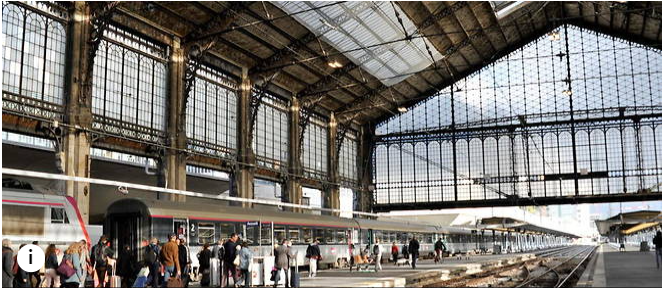

# Peces de ciudad



- Letra: Joaquín Sabina 
- Música: Joaquín Sabina,Pancho Varona
- CD: " Dímelo en la calle " (2002)

**Intro** 
```
G D A
```
```
                     A          F#m               D                   A
 Se peinaba a lo garçon la viajera que quiso enseñarme a besar en la Gare d'Austerlitz.
       F#m                D                     Bm                E
 Primavera de un amor amarillo y frugal como el sol del veranillo de San Martín.
            D                     C#m
 Hay quien dice que fui yo el primero en olvidar
           G                      D                   E
 cuando en un si bemol de Jacques Brel conocí a mademoiselle Amsterdam.
      A                        F#m                D
 En la fatua Nueva York da mas sombra que los limoneros
                A                   F#m
 la estatua de la libertad. Pero en Desolation Row
        D                 Bm              E
 las sirenas de los petroleros no dejan reir ni volar.
          D                 C#m                         G
 Y en el coro de Babel desafina un español. No hay mas ley
                   D                     A
 que la fiebre del oro en las minas del rey Salomón.
 
 
         E                     D                       C#m
 Y desafiando el oleaje sin timón ni timonel por mis sueños va
                Bm                         A
 ligero de equipaje sobre un cascarón de nuez
                 E                     F#m
 mi corazón de viaje, luciendo los tatuajes de un
             D                        A
 pasado bucanero de un velero al abordaje de un
 G    D         A
  liguero de mujer.
          E                        D
 Y como huir cuando no quedan islas para naufragar
      C#m                       Bm
 al país donde los sabios se retiran
                    A                        E
 del agravio de buscar labios que sacan de quicio,
                      F#m                         D                          A
 mentiras que ganan juicios tan sumarios que envilecen el cristal de los acuarios de los 
G D           A  G         D           A
 peces de ciudad, que mordieron el anzuelo,
E                       D                      A
 que bucean a ras del suelo, que no merecen nadar.
 
 
[Interlude]
G  D  A
 
 
A                                 F#m                 D                  A
 El dorado era un shampoo, la virtud unos brazos en cruz, el pecado una página web.
       F#m                     D                    Bm                 E
 En Comala comprendí que al lugar donde has sido feliz no debieras tratar de volver.
             D                     C#m                   G                 D
 Cuando en vuelo regular pisé el cielo de Madrid me esperaba una recién casada que no
        A
 se acordaba de mi.
 
 
         E                     D                       C#m
 Y desafiando el oleaje sin timón ni timonel por mis sueños va
               Bm                          A
 ligero de equipaje sobre un cascarón de nuez
                 E                     F#m
 mi corazón de viaje, luciendo los tatuajes de un
             D                         A
 pasado bucanero, de un velero al abordaje de un
G    D          A
 liguero de mujer.
          E                        D
 Y como huir cuando no quedan islas para naufragar
      C#m                       Bm
 al país donde los sabios se retiran
                    A                        E
 del agravio de buscar labios que sacan de quicio,
                      F#m                         D                         A
 mentiras que ganan juicios tan sumarios que envilecen el cristal de los acuarios de los 
G D           A
 peces de ciudad,
G         D           A     E                      D                         A
 que perdieron las agallas   en un banco de morralla, en una playa sin mar.
```
**Final**
```
G D A
```