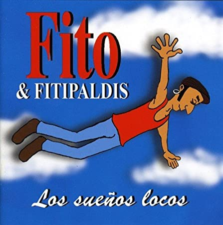
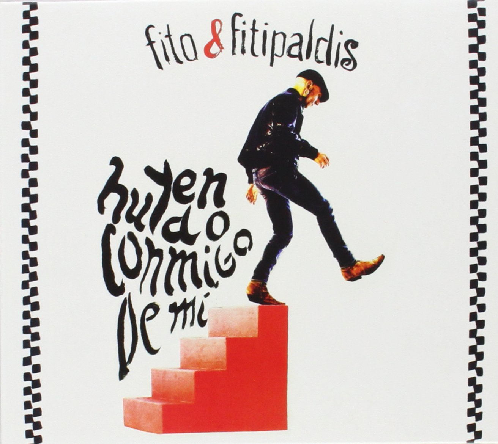
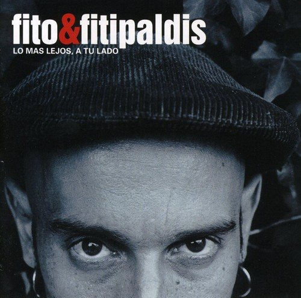
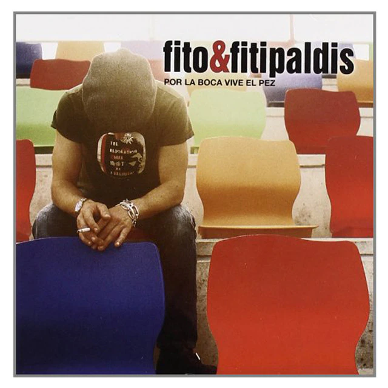

<div style="page-break-after: always;"></div>

- [Los sueños locos](#los-sueños-locos)
  - [01. Al mar](#01-al-mar)
  - [02. Para toda la vida](#02-para-toda-la-vida)
  - [03. Perro viejo](#03-perro-viejo)
  - [04. Cerca de las vías](#04-cerca-de-las-vías)
  - [05. A la luna se le ve el ombligo (4:51)](#05-a-la-luna-se-le-ve-el-ombligo-451)
- [A puerta cerrada (2014)](#a-puerta-cerrada-2014)
  - [01. Rojitas las orejas](#01-rojitas-las-orejas)
  - [02. Trozos de cristal](#02-trozos-de-cristal)
- [Huyendo conmigo de mi (2014)](#huyendo-conmigo-de-mi-2014)
  - [01. Entre La Espada Y La Pared](#01-entre-la-espada-y-la-pared)
  - [02. Lo que sobra de mí](#02-lo-que-sobra-de-mí)
  - [03. Pájaros disecados](#03-pájaros-disecados)
  - [04. Nos Ocupamos Del Mar](#04-nos-ocupamos-del-mar)
  - [05. Nada De Nada](#05-nada-de-nada)
  - [06. El Vencido](#06-el-vencido)
  - [Garabatos](#garabatos)
  - [Lo Que Siempre Quise Hacer](#lo-que-siempre-quise-hacer)
  - [Umore Ona](#umore-ona)
  - [Después Del Naufragio](#después-del-naufragio)
- [Lo más lejos a tu lado (2003)](#lo-más-lejos-a-tu-lado-2003)
  - [La Casa Por El Tejado](#la-casa-por-el-tejado)
  - [Un Buen Castigo](#un-buen-castigo)
  - [Feo](#feo)
  - [El Ojo Que Me Mira](#el-ojo-que-me-mira)
  - [Soldadito Marinero](#soldadito-marinero)
  - [Corazón Oxidado	4:01](#corazón-oxidado401)
  - [Quiero Ser Una Estrella	3:21](#quiero-ser-una-estrella321)
  - [Nada Que Decir	3:00](#nada-que-decir300)
  - [Vamonó	3:30](#vamonó330)
  - [Las Nubes De Tu Pelo	5:09](#las-nubes-de-tu-pelo509)
  - [Whisky Barato	3:18](#whisky-barato318)
  - [Siempre Estoy Soñando	4:16](#siempre-estoy-soñando416)
- [Por la boca vive el pez (2006)](#por-la-boca-vive-el-pez-2006)
  - [01. Por La Boca Vive El Pez](#01-por-la-boca-vive-el-pez)
  - [02. Me Equivocaría Otra Vez](#02-me-equivocaría-otra-vez)
  - [Como Pollo Sin Cabeza	4:10](#como-pollo-sin-cabeza410)
  - [Sobra La Luz	3:35](#sobra-la-luz335)
  - [Viene Y Va](#viene-y-va)
  - [214 Sullivan Street](#214-sullivan-street)
  - [Donde Todo Empieza](#donde-todo-empieza)
  - [Deltoya	2:25](#deltoya225)
  - [Acabo De Llegar	6:15](#acabo-de-llegar615)
  - [No Soy Bob Diddley	3:49](#no-soy-bob-diddley349)
  - [Medalla De Cartón	5:18](#medalla-de-cartón518)
  - [Esta Noche	4:03](#esta-noche403)
  - [Abrazado A La Tristeza](#abrazado-a-la-tristeza)
- [Antes de que cuente diez (2009)](#antes-de-que-cuente-diez-2009)
  - [01. Antes de que cuente diez](#01-antes-de-que-cuente-diez)
  - [Me acordé de tí](#me-acordé-de-tí)
  - [Tarde o temprano](#tarde-o-temprano)
  - [14 vidas son dos gatos](#14-vidas-son-dos-gatos)
  - [Todo a cien](#todo-a-cien)
  - [Los Huesos De Los Besos	4:30](#los-huesos-de-los-besos430)
  - [Que Me Arrastre El Viento	4:27](#que-me-arrastre-el-viento427)
  - [Qué Necesario Es Rock & Roll	5:28](#qué-necesario-es-rock--roll528)
  - [Conozco Un Lugar	4:03](#conozco-un-lugar403)
  - [La Cuisine De Bernard](#la-cuisine-de-bernard)
- [Cada vez cadáver](#cada-vez-cadáver)
  - [Si me ves así](#si-me-ves-así)
  - [Cielo hermético](#cielo-hermético)

Última modificación: Agosto 2021

# Los sueños locos

- Sello: DRO – 2564694069
- Publicado: 2008
- Género: Rock
- Estilo: Pop Rock



<div style="page-break-after: always;"></div>

## 01. Al mar

**Estrofa**
```
Bueno, a disfrutarla.
Por cierto, donde he puesto el D9 sería:
 E |-x-|  pero no se como se llama.
 B |-6-|
 G |-5-|
 D |-4-|
 A |-5-|
 E |-x-|


E  |-----------------------------------3---|
B  |-----------------------------------3---|
G  |--2h3p2-------------5b(6)b5--3---------|
D  |---------3--3/5--5--------------5------|
A  |---------------------------------------|
E  |---------------------------------------|


E  |--------------------------------------------------|
B  |--------------------------------------------------|
G  |--2h3p2--------------------------------3----------|
D  |---------3-----------------------5------5p3p0--5--|
A  |------------3b(4)b3--1--------5-----5-------------|
E  |------------------------3--3----------------------|


F              Gm
Estoy aquí otra vez
F              Gm
en la orillita del mar
Cm         F        Gm
mientras me mojo los pies
F              Gm
he empezado a imaginar.


F              Gm
Tú si que debes saber
F              Gm
que si pudieras hablar
Cm       F         Gm
tienes secretos que sé
F              Gm
nunca los vas a contar.


Cm                     D9         Gm
Guardas los suspiros de corazones rotos
Cm                        F                      Gm
y todas las miradas de los hombres que se sienten solos.
Cm                      D9                Gm
Dejas que la Luna por la noche te toque un poco
Cm                      D9             Cm          D9
con la lucecita que ilumina los sueños locos.


F              Gm
Mi barco es de papel
F              Gm
Pero saldré a navegar
Cm         F       Gm
En la isla donde tú estés
F              Gm
Allí quiero naufragar.


F               Gm
Y que me huela la piel
F               Gm
A roca, espuma y a sal
Cm       F        Gm
Dime qué tengo que hacer
F              Gm
Para ser tu capitán


Cm                     D9         Gm
Guardas los suspiros de corazones rotos
Cm                        F                      Gm
y todas las miradas de los hombres que se sienten solos.
Cm                      D9                Gm
Dejas que la Luna por la noche te toque un poco
Cm                      D9             Cm          D9
con la lucecita que ilumina los sueños locos.


         Gm
Los sueños locos...
         Cm
Los sueños locos...
         D
Los sueños locos...
         F      D9
Los sueños locos...
```
<div style="page-break-after: always;"></div>

## 02. Para toda la vida

**Estrofa**
```
G                           C
Cuando estuviste conmigo, jamás te dije mentira,
G                              C
quería tenerte en mis brazos. pero por toda la vida.
F                         C
Y tú querías aventura, tomaste muy mal camino,
G                    C
ibas buscando basura en un terreno barrido.

```
**Estribillo**
```
      F                             C
Yo le doy mi querer al querer y lo doy para toda la vida.
      G                            C
Si quisiera vivir de placer me buscaba un amor de cantina.
      F                             C                     G C
Yo le doy mi querer al querer y lo doy para toda la vida.
```
**Estrofa** 
```
 G                           C
Cuando estuviste conmigo, Tenías un mal pensamiento.
   G                     C
Si yo lo hubiera sabido no hubiera perdido el tiempo.
    F                               C
Tendrás el mundo en tus manos, tendrás montones de besos
           G                 C
si a todos tienes llorando, conmigo tocaste hueso.
```
<div style="page-break-after: always;"></div>

**Estribillo**
```
      F                             C
Yo le doy mi querer al querer y lo doy para toda la vida.
      G                            C
Si quisiera vivir de placer me buscaba un amor de cantina.
      F                             C                     G C
Yo le doy mi querer al querer y lo doy para toda la vida.
 ```
**Instrumental**
```
C G x 8
 
```
**Estribillo**
```
      F                             C
Yo le doy mi querer al querer y lo doy para toda la vida.
      G                            C
Si quisiera vivir de placer me buscaba un amor de cantina.
      F                             C                     G C
Yo le doy mi querer al querer y lo doy para toda la vida.
    G
Si quisiera vivir de placer
hay para toda la vida... G F C
```
<div style="page-break-after: always;"></div>

## 03. Perro viejo

**Intro**
```
Dm-Gm-A y vuelve a Dm
```
**Estrofa**
```
Dm               Gm
Hola amigo, ¿Qué haces por aquí?
A              Dm     Dm               Gm
¿vienes de muy lejos?   ¿estás sucio o es que eres así?
A              Dm     Dm                 Gm
sólo huesos y pellejos  tengo un trato para ti: 
A                 Dm
yo te doy comida y techo 
Dm              Gm
si me enseñas a vivir 
A               Dm
como vive un perro viejo
``` 
**Estribillo**
```
C            Dm7
como vive un perro viejo
A               Dm
como perro viejo leerle
C            Dm7          A  Dm
como vive un perro viejo
 
``` 
**Estrofa**
```


¿sabes? yo también sentí que me ataban por el cuello

la quería y la perdí la noche de aquel invierno

no se si ahora soy feliz la verdad que no lo intento;

si me apuras a decir soy igual que un perro viejo

Estribillo

 

Parte instrumental: Rem-Solm-La-Rem

Solo

 

Parte 3

 

bebiendo para olvidar me olvidé que estaba bebiendo

es reir por no llorar no se lo que estoy diciendo...

que bebiendo para olvidar la verdad te estaba mintiendo

es reir por no llorar, no sé lo que estoy diciendo

 

Estribillo
 
 ```


<div style="page-break-after: always;"></div>

## 04. Cerca de las vías

```
D               C                       G           D                      C
Hay días que parece que nunca se va a apagar el sol, y otros son más tristes
                        G        C              B7
que una despedida en la estación. es igual que nuestra vida 
                     Em  D               C                        G
que cuando todo va bien,  un día tuerces una esquina y te tuerces tu también.
``` 
``` 
D        C                       G
Esa telaraña que cuelga en mi habitación
D                C                    G
no la quito, no hace nada, solo ocupa su rincón.
```
**Estribillo**
```
C              B7                     Em
Yo he crecido cerca de las vías y por eso sé,
D                  C                        G
que la tristeza y la alegría, viajan en el mismo tren
D(sorda)                                  G
¿Quieres ver el mundo? Mira, esta debajo de tus pies.

D C G x 4
```
**Estrofa**
``` 
D            C                        G
Con el paso de los años  nada es como yo soñé.
D               C                         G
Si no cierras bien los ojos, muchas cosas no se ven.
C              B7                           Em 
No le tengo miedo al diablo ¿no ves que no puedo arder?
D               C                                  G
No hay mas fuego en el infierno del que hay dentro de mi piel.
 
D          C                         G
Todo lo malo y lo bueno caben dentro de un papel.
D(sorda)                                 G
¿Quieres ver el mundo? Mira, está debajo de tus pies.

```

<div style="page-break-after: always;"></div>

## 05. A la luna se le ve el ombligo (4:51)

**Estrofa**
``` 
Am              Dm       Em    Am    Dm    Em
    No se cuanto tiempo habré perdido
    Am                     Dm    Em    Am     Dm    Em
    vivo tan deprisa que se cae de los bolsillos
Am            Dm     Em   Am    Dm    Em
    a pesar de todo he aprendido
    Am                      Dm      Em         Am    Dm    Em
    si la noche es clara a la luna se le ve el ombligo 
 
    E
    mira que a luna se le ve el ombligo
```
**Estribillo**
```
 
C             Dm     Em       Am    Dm    Em
    Ojalá me hubiera dado cuenta antes
Dm                 C    Em        Am    Dm    Em
    no siempre lo urgente es lo importante
F                   C        Em          G    Dm    Em
    tal vez son las brujas, tal vez el destino
Dm                C          Em     Am
    yo siempre me pierdo en el mismo camino
    Dm           C      Em
    siempre en el mismo camino
 
 
Am            Dm      Em    Am    Dm    Em
    Ahora sólo quiero estar contigo
    Am                     Dm  Em     Am    Dm    Em
    todo mi universo está debajo de tu ombligo
Am                Dm  Em  Am    Dm    Em
    Por tus huesos loco de remate
    Am                     Dm    Em   Am    Dm    Em
    todos los molinos se convierten en gigantes.
 
       Am                 Dm    Em
    Quisiera ser tan alto como la luna
      Am                        Dm     Em
    mirar por tu ventana cuando estás desnuda.
     Am                 Dm        Em
    Al pasar la barca me dijo el barquero
     Am                      Dm      Em
    de Africa a Tarifa cuesta mucho más dinero
 
    F                       G            F                      Em          
    Mucho más dinero, mucho más dinero, mucho más dinero, mucho más dinero.
 
 
C             Dm     Em       Am    Dm    Em
    Ojalá me hubiera dado cuenta antes
Dm                 C    Em        Am    Dm    Em
    no siempre lo urgente es lo importante
Dm                 C      Em           Am    Dm    Em
    tal vez son las brujas, tal vez el destino
Dm                C          Em     Am
    yo siempre me pierdo en el mismo camino
    Dm           C      Em
    siempre en el mismo camino
```
Am E Am E

<div style="page-break-after: always;"></div>

# A puerta cerrada (2014)

<div style="page-break-after: always;"></div>

## 01. Rojitas las orejas

**Intro**
```
Em C D
Em C D
```
**Estrofa**
```
Em           C              D             C 
pa parabaraba pa parabaraba pa parabaraba pa parabaraba
Em           C              D             C 
pa parabaraba pa parabaraba pa parabaraba pa parabaraba

```
**Instrumental**
```
Em C D
Em C D
```
**Estrofa**
```
Em              C             D             C
Que tiene tu veneno, que me quita la vida, solo con un beso
Em              C             D             C
Y me lleva a la luna y me ofrece la droga que todo lo cura
Em              C         D                  C
Dependencia bendita, invisible cadena que me ata a la vida
Em              C            D                         C
Y en momentos oscuros, palmadita en la espalda y ya estoy más seguro
```

<div style="page-break-after: always;"></div>

**Estribillo**
```
Am  Asus4  Am  Asus4 Am  Asus4  Am  Asus2
C                       D
Se me ponen si me besas, rojitas las orejas
```
**Estrofa**
```
Em           C              D             C 
pa parabaraba pa parabaraba pa parabaraba pa parabaraba
Em           C              D             C 
pa parabaraba pa parabaraba pa parabaraba pa parabaraba
```
**Estrofa**
```
Em              C           D                  C
Pon carita de pena, que ya sabes que haré todo lo que tu quieras
Em             C          D                     C
Ojos de luna llena, tu mirada es de fuego y mi cuerpo de cera
Em      C          D         C
Tu eres, mi verso, pluma papel y sentimiento
Em        C              D          C
La noche yo y tu la luna. Tu la cerveza y yo la espuma
```
**Estribillo**
```
Am  Asus4  Am  Asus4 Am  Asus4  Am  Asus2
C                       D
Se me ponen si me besas, rojitas las orejas (X2)
```
**Final**
```
Em      C          Em          D
Roooooojitas las orejas se me ponen si me besas (x4)
```

<div style="page-break-after: always;"></div>

## 02. Trozos de cristal
```
[Intro]
Dm7     Gm7      Dm7      Dm7
Gm7     Gm7      Dm7      Dm7
A7      Gm7      Dm7      A7
x2

[Verse 1]
C                      Bb                    Dm
Voy a ver si me encuentro dentro de mi piel
C                  Bb                    Dm
y comprendo porqué nada puedo entender.
C                 Bb                 Dm
Me resulta tan raro todo lo normal,
C                Bb                   Dm
me tropiezo, me caigo y vuelvo a tropezar.

[Chorus]
F
Creí que me había equivocado,
A
luego pensé...
Dm                      Bb
que estoy bien aquí en mi nube azul.
F         A7
Todo es como yo lo he inventado
Dm              Bb
y la realidad trozos de cristal
F                    A
que al final hay que pasar descalzo... alzoo!!

[Verse 2]
C                       Bb            Dm
Por favor no me empuje, me puedo caer
C                               Bb             Dm
Yo en mi nube estoy bien, no me va a convencer
C                           Bb               Dm
ya conozco unos cuantos que son como usted
C                      Bb             Dm
que me ofrecen veneno cuando tengo sed.

[Chorus]
F
Creí que me había equivocado,
A
luego pensé...
Dm                      Bb
que estoy bien aquí en mi nube azul.
F         A7
Todo es como yo lo he inventado
Dm              Bb
y la realidad trozos de cristal
F                    A
que al final hay que pasar descalzo
Dm
   estoy bien aquí en mi nube azul.
F         A7
Todo es como yo lo he inventado
Dm              Bb
y la realidad trozos de cristal
F                    A
que al final hay que pasar descalzo

[Outro]
Dm7     Gm7      Dm7      Dm7
Gm7     Gm7      Dm7      Dm7
A7      Gm7      Dm7      A7
x2

```
<div style="page-break-after: always;"></div>

# Huyendo conmigo de mi (2014)



<div style="page-break-after: always;"></div>
<div style="page-break-after: always;"></div>

## 01. Entre La Espada Y La Pared


**Intro**
```
Fmaj7  | Fmaj7  | C |  C | x2
```
**Estrofa**
``` 
           F
Entre lo amargo del café, quedó el aroma y el calor
           C
Lo que me dio, me lo dejó, cuando se fue
          G
Con la certeza y la razón, de sabe Dios quién sabe qué
           Am
Que lo invisible existe sólo porque no se ve
           F
No soy la foto del carnet, no soy la luz en el balcón
         C
Yo solo soy el que llegó y el que se fue
 
           G
No sé muy bien a dónde voy, para encontrarme búscame
         Am
En algún sitio entre la espada y la pared
     F                   C                 G
Las nubes con el viento siempre están cambiando
     F                 C                 G
Quizás podamos ver el sol de vez en cuando
``` 
**Intrumental**
```
Fmaj7  | Fmaj7  | C |  
        F                                                 C
Puede ser que todo vuelva a ser, cuando es tarde para responder, que nunca más, 
          G
Voy a quedarme en este mar aunque me estrelle entre las rocas
         Am
Aunque me pise el mismo pie que antes beso mi boca
          F          C           G
No encontrar el equilibro Y agarrarse
          F        C             G
Lo contrario de vivir es no arriesgarse 
                   F 
O quien sabe qué
```
**Estrofa**
``` 
F | F | F | F
C
        Oh no no no no no nono
F 
Am | Am | G | G       
```
**Estrofa**
```  
          Am                      Dm
Maldita noche que pasé. No sé muy bien por qué razón
              G                    F
Que sin dormirme te soñé. Me pareció escuchar tu voz       
         Am                          Dm
Toda la culpa es del café. Que me recuerda tu sabor
          G                              F
Y fue la voz que no escuché. Y fue el silencio el que me despertó
```
**Estrofa**
``` 
               C
Toda la culpa fue del aire que rozó mi piel
       Dm                      G
De la piel que me guardó el calor
                 Am
El mismo con el que forjé
                 C
Mi oxidado corazón
                         Dm
Las cosas que no pueden ser
                           G
Son todas las que he sido yo
                         F
Las mezclas no me salen bien
G                      F 
Sexo, drogas, rock & roll
C 
   Sexo, drogas, rock & roll
```
**Final**
```
F 
Am | Am | G | G 
Dm | - | F | G
Am
```

<div style="page-break-after: always;"></div>

## 02. Lo que sobra de mí

| Tonalidad | Tempo   | Compás | Capo |
| --------- | ------- | ------ | ---- |
| Fa menor  | 142 bpm |        | 1    |

**Intro**
```
C        D
Aaaaaaah, aaaaaaah, aaaaaaaaaaah!
```
**Estrofa**
```
G
Tuve que aprender de nuevo a respirar, de nuevo tuve que aprender.
Em
Hice agujeros en la capa del disfraz de Superman que nunca me he querido poner. 
      C
Me jugué a una carta la felicidad, nunca pensé que la pudiera perder.
        G
Toda la vida era un cuento y yo era Peter Pan, por eso no he podido crecer. 
    D
Ya llega la tormenta, ya la oigo venir, viene derechita hacia aquí.
           Em
haciendo: “bom... bom... bom... bom... bom”
```
**Estribillo**
```
C                      D                Em
Si me concedieras un deseo para hacerme feliz,
         G          D               Em
me gustaría cortar todo lo que sobra de mí.
C                      D                Em
Ahora sé que el cielo no está lejos, nosotros sí.
C                  D             C
Demasiado tiempo huyendo conmigo de mí.
 
D                        G
Aaaaaaah, aaaa  aaah,  aaaaaaaaaah!
```
**Estrofa**
``` 
G
No era la más fea y me sacó a bailar, ella me sacó a bailar.
Em
Y movía las caderas para despistar, solo para despistar.
C
Fue tan larga la condena, solo un día más, solo un día más...
G
Como un suspiro que debió durar lo mismo que la eternidad.
``` 
**Pre-estribillo**
``` 
    D
Ya llega la tormenta, ya la oigo venir, viene derechita hacia aquí.
           Em
haciendo: “bom... bom... bom... bom”
``` 
**Estribillo**
```
C                      D                Em
Si me concedieras un deseo para hacerme feliz,
         G          D               Em
me gustaría cortar todo lo que sobra de mí.
C                      D                Em
Ahora sé que el cielo no está lejos, nosotros sí.
C                  D             G
Demasiado tiempo huyendo conmigo de mí.
```
**Puente**
``` 
          D                            Em
Sé que la próxima estación de nuevo me despido,
          C            G         D
Y sé que nunca dije “adiós” convencido
C                  D          Em
Y complicarme me resulta muy sencillo
          D
Igual que respirar...
 
```
**Solo**
``` 
C  |  D  | Em | - |
G  |  D  |  Em | - |
``` 
**Estribillo**
```
C                      D                Em
Ahora sé que el cielo no está lejos, nosotros sí.
C                  D             C
Demasiado tiempo huyendo conmigo de mí.
D
Aaaaaaah, aaaaaaah, aaaaaaaaaaah!
G
Aaaaaaaaaaah!
```

<div style="page-break-after: always;"></div>

## 03. Pájaros disecados

| Tonalidad | Tempo  | Compás | Capo |
| --------- | ------ | ------ | ---- |
| Re menor  | 65 bpm |        | 1    |


**Intro**
``` 
Bb  C   Dm
Bb  G   F C     Dm...
```
**Estrofa**
```  
        Dm                        F
Yo no sabía lo que sucedía, me sentía triste y agobiado,
          C                                 G
tan deprimido que tenía la cabeza llena de pájaros disecados.
          Dm                                 F
Tengo algo amargo para cada día, tengo un final para cada verano,
             C                                    G                 Dm                                              
Tengo una esquina junto a mi rodilla, Tengo el problema para el resultado 
```
**Estribillo**
``` 
         Bb                            C
Soy el autor de mis heridas, que me importa si es mentira
      Dm
la verdad es que me hacen daño
          F                              C              G
si el corazón se te hace migas, la tristeza cada día, viene y come de tu mano. 
Bb            C           Dm
Se que tengo que olvidar este frío mes de enero,
Bb            G            Dm
luego volveré a brillar de nuevo.
```
**Solo**
```  
Bb  C   Dm
Bb  G ...
```
**Estrofa**
```  
          Dm
no estoy seguro de tener la certeza
         F
que la moneda cae del otro lado
             C
mientras las luces giran en mi cabeza
           G
de igual manera que si fueran dados
 
         Dm
son los restos que quedan de mi,
       F
lo que pude salvar del incendio,
        C                      G
son las huellas que dejo al cruzar
                 Dm
por mi propio desierto
 
```
**REPITE ESTRIBILLO**

**Solo**
``` 
F | C | Bb G | Dm  x2
```
**Estrofa**
``` 
         Bb
Soy el autor de mis heridas,
          C
que me importa si es mentira
      Dm
la verdad es que me hacen daño
          F
si el corazón se te hace migas,
       C              G
la tristeza cada día, viene y come de tu mano.
 
Bb            C           Dm
Se que tengo que olvidar este frío mes de enero,
Bb            G            Dm
luego volveré a brillar de nuevo.
 
OUTRO:
F | C | Bb G | Dm  x2
```
<div style="page-break-after: always;"></div>

## 04. Nos Ocupamos Del Mar	

| Tonalidad | Tempo | Compás | Capo |
| --------- | ----- | ------ | ---- |
| La mayor  | bpm   |        | 2    |

**Intro piano**
``` 
G D G C
Em D C G
```
**Intro guitarras**
```
G D
G C
Em D C G
```
**Estrofa**
```
G                 D       B                   C
Nos ocupamos del mar y tenemos dividida la tarea
C                    G                 D
Ella cuida de las olas, Yo vigilo la marea
      B           C         D         G
Es cansado,  Por eso al llegar la noche
      G             Em         G   D          C
Ella descansa a mi lado. Y mis ojos en su costado 
G                      D           B                       C
También cuidamos la tierra, Y también con el trabajo dividido
C                      G                         D
Yo troncos, frutos y flores, Ella riega lo escondido
      B           C         D         G
Es cansado,  Por eso al llegar la noche
      G             Em         G   D          C
Ella descansa a mi lado. Y mis ojos en su costado 
 
```
**Solo**
``` 
C Em G D
C Em G D G 
```
**Estrofa**
```  
G                    D          B                       C
Todas las cosas cuidamos,  Cada uno según el nuestro talante
C                     G                         D
Yo lo que tiene importancia, Ella todo lo importante
```
**Estrofa**
``` 
      B           C         D         G
Es cansado,  Por eso al llegar la noche
      G             Em         G   D          C       G   D          C
Ella descansa a mi lado. Y mi voz en su costado. Y mi voz en su costado 
```
**Estrofa**
``` 
Repetir x3

G D
G C
Em D G

El cuarto:
 
G D
G C
Em D (largo)
G
```

<div style="page-break-after: always;"></div>

## 05. Nada De Nada	

| 🎸  Tonalidad | Tempo  | Compás | Capo |
| ------------ | ------ | ------ | ---- |
| Do mayor     | 63 bpm |        | No   |

<p style="color:red">Estrofa</p>

```
C
       C
No hay nada por lo que brindar
   G
Y queda tanto por beber
   F
La gente deja de fumar
          C                      G
Porque no tiene tiempo de toser
       C
Cuando pase ya la tempestad
      G
Habrá tiempo para hacerlo bien
       F
Nos vendieron tanto bienestar
             C                   G
Que no hay manera de poder estar bien
 
F                                           C
Mientras todos dicen "nadie es culpable de nada"
Am                                 G
Dime si sonrío con la gravedad adecuada
F                  E                  Am      D
Tiempo de ladrones, de cerrar las persianas
      C            G        C
De lo que me digas, nada de nada
 
 C
¿Cómo voy a entrar en razón?
          G
Si nunca salgo de mi asombro
         F
Si cada vez que buscas la solución
           C                    G
Es para cargarla sobre nuestros hombros
           C
Conozco un perro que no dice mentiras
       G
Hay un juez que está aprendiendo a ladrar
          F                   G#
Cuando la boca se te llena de ruido
        C                 G
Luego está condenada a gritar
 ```
**Estrofa**
```
 
F                                           C
Mientras todos dicen "nadie es culpable de nada"
Am                                 G
Dime si sonrío con la gravedad adecuada
F                  E                 Am      D
Tiempo de ladrones, de cerrar las persianas
      C            G        F     G#
De lo que me digas, nada de nada
 ```
**Instrumental**
```
C     G     F     C  G
C     G     F  G#   C
 ```
**Estrofa**
```
F                                           C
Mientras todos dicen "nadie es culpable de nada"
Am                                 G
Dime si sonrío con la gravedad adecuada
F                  E                 Am      D
Tiempo de ladrones, de cerrar las persianas
      C            G        F     G#
De lo que me digas, nada de nada
        C
Nada de nada
      F           G#        C
De lo que me digas, nada de nada
        F    G#    C
Nada de nada
        F    G#    C
Nada de nada
```

<div style="page-break-after: always;"></div>

## 06. El Vencido	

| 🎸  Tonalidad | Tempo | Compás | Capo |
| ------------ | ----- | ------ | ---- |
| Do mayor     | bpm   | 3/4    | 3    |

 
https://www.youtube.com/watch?v=WzHpnutt5O8

**Estrofa**
```  
G    D               Em    G     D      Em
Cada vez que estoy perdido en la noche oscura,
C      D            Em           Am               B7
se que todo lo que escribo, a veces me mata y a veces me cura.
G          D      Em    G      D               Em
Y aunque a veces quema,   el calor siempre te ayuda.
C     D               Em             B            B7
Cada vez que llega el frío, a mi verdad desnuda.
 ```
**Estrofa**
``` 
           Am                           Em
Dice que estoy perdiendo el tiempo en vivir deprisa.
        B                            Em
Mi vida pasa como el viento, pero jamás sentí la brisa.
           Am               C      D             G
Dice que estoy perdiendo el tiempo,  en vivir deprisa. 
```
**Estrofa**
```
G D Em
G Em
 ```
**Estribillo**
```
                   G    D          Em
Soy el gran triunfador,  soy el vencido.
                   G   D        Em
Tengo un diente de oro, y otro partido.
             G                D         Em
Mi sentido común, nunca lleva razón, es mi enemigo. 
               C                B7               C    C/B  Am
Si lo pienso mejor, si sucede otra vez, sé que estoy peeerdido.
 
```
**Estrofa**
``` 
G B
Em A
G B C D#
G D Em 
```
**Estrofa**
``` 
           Am
Dice que estoy perdiendo el tiempo
     Em
en vivir deprisa.
        B7
Mi vida pasa como el viento
       Em
pero jamás sentí la brisa.
           Am         C        D
Dice que estoy perdiendo el tiempo
           G
en vivir deprisa.
 
```
**Estrofa**
``` 
G D Em
G D Em
G D Em
```

<div style="page-break-after: always;"></div>

## Garabatos

| 🎸  Tonalidad | Tempo  | Compás | Capo |
| ------------ | ------ | ------ | ---- |
| Fa menor     | 77 bpm |        | No   |

**Estrofa**
```  
A#                       Cm
Todo llega y todo pasa como un espejismo.
       G#            A#       Cm
Todos fuimos garabatos de nosotros mismos.
A#                          Cm
Lo que queda en la mirada no es que est  escondido.
         G#                 A#                  Cm
Pero hay cosas que solo se ven si pasas cerca del abismo.
```
**Pre-estribillo**
``` 
          Fm                        G
Y en las puertas de mi barrio descubr  la vida.
```
**Estribillo**
``` 
 
              D#    A#                   Cm
Y la quise besar      y ella quería morderme.
                    D#         A#             Cm
toda mi vida es un gesto que solo tus ojos entienden.
                D#    A#                   Cm
Yo la quería besar      y ella quería morderme.
 
 
D#  A#  Cm  
```
**Estrofa**
```  
     A#                         G#
Ordenando mis recuerdos he pensao que todo fue
Cm
hace mucho tiempo ya
          A#                     G#
Y cada ma ana en el espejo le saludo siempre al viejo
       Cm
que llegó  cuando se fue  el chaval.
A#                       Cm
Casi como un accidente me envolvi  el sonido.
         G#                   A#                  Cm
Hay canciones que te dan de frente y te se alan el camino.
```
**Pre-estribillo**
``` 
          Fm                        G
Y en las puertas de mi barrio descubrí  la vida.
```
**Estribillo**
``` 
              D#    A#                   Cm
Y la quise besar      y ella quería morderme.
                    D#         A#             Cm
toda mi vida es un gesto que solo tus ojos entienden.
                D#    A#                   Cm
Yo la quería besar      y ella quería morderme.
                    D#         A#             Cm
toda mi vida es un gesto que solo tus ojos entienden.
```
**Solo**
```  
Fm D#  A#  Cm - x2 
```
**Puente**
``` 
         Fm                    D#
Abrió  la boca y me tragó  y no dejó  de repetir
         A#               Cm
ven a mi lado y te daré  todo lo que pidas.
             Fm                      D#
Y ahora que sé  que me engañó   solo me queda por decir
         A#                Cm
que cada vez que me perdí  me encontré  la vida.
```
**Estribillo**
``` 
              D#    A#                   Cm
Y la quise besar      y ella quería morderme.
                    D#         A#             Cm
toda mi vida es un gesto que solo tus ojos entienden.
                D#    A#                   Cm
Yo la quería besar      y ella quería morderme.
                    D#         A#             Cm
toda mi vida es un gesto que solo tus ojos entienden.
 
```
**Final**
```  
Fm  D#   A#  Cm
Fm  D#  A#  Cm
Fm Cm D# A# Cm
Fm D# A# C
Fm D# G# Cm
Fm D# A# Cm
```

<div style="page-break-after: always;"></div>

## Lo Que Siempre Quise Hacer	
```
[Intro]
G  C  G  D  C  G  D

[Verse 1]
G
No voy a hacerlo, ya sabes que

Aunque lo intento, no puede ser
C                                        G
Soy perro viejo y no puedo empezar otra vez
           D
Prefiero darle al boggie-boggie
        C                           G   D
Porque eso es lo que a mi me sienta bien

G
No estoy enfermo, no tengo estrés

No tengo nada para vender
C
No tengo joyas, no tengo fe
G
No hay más batallas para perder
      D
Pero tengo boggie-boggie
         C                           G  D
Porque eso es lo que a mi me sienta bien

[Chorus]
          G
No voy a dar un solo paso
         C                     G
Del que luego arrepentirme después
           C
No se si somos lo que fuimos
                                  G
Pero hago lo que siempre quise hacer
               D
Y aunque no siempre divertido
      C                    G   D
Es mejor de lo que nunca soñé

[Instrumental]
G C G D C G D (2x)

[Verse 2]
G
No me interesa lo que pienses de mi

Si no lo entiendes lo vuelvo a repetir
C
No tengo joyas, no tengo fe
G
No tengo nada para vender
      D
Pero tengo boggie-boggie
        C                            G  D
Porque eso es lo que a mi me sienta bien

[Chorus]
          G
No voy a dar un solo paso
          C                     G
Del que luego arrepentirme después
           C
No se si somos lo que fuimos
                                 G
Pero hago lo que siempre quise hacer
              D
Y aunque no siempre divertido
      C                    G  D
Es mejor de lo que nunca soñé

[Outro]
G  C  G  D  C  G  D (2x)
G  C  G  D  C  G  D  G
```

<div style="page-break-after: always;"></div>

## Umore Ona	

<div style="page-break-after: always;"></div>

## Después Del Naufragio


**Intro**
``` 
G C | G | G   | D 
C D | G | G D | G
```
**Estrofa**
``` 
G                      D           C        D          G
Desperté y salí de la sombra. Me curé cada hueso y empecé
G                               D            C             D         G
A olvidar noche a noche los recuerdos, Los abismos donde nunca volveré

 
   Bm              Am          G
Y escuchando en oscuros callejones
       F                C              G
Las canciones que se pierden en la cara b
 F                   C             G
Fui mirando y revolviendo los cajones
      D
Y desperté...
 
 
    G                      D
Me cansé de las horas infelices
    C         D            G
Me acabe la botella y escuche
              G 
Que no hay dolor mas insoportable
              D
Que el que admites
    C          G           D
Que no sea lo que tenga que ser...
```
**Estribillo**
```  
                    C                             G
Y después del naufragio, de que sirve estar tan triste
       Bm            Am          G
Nunca jurare que no vuelva a suceder
                    C                      G
Sabes que cuando canto, nunca piso tierra firme
       Bm              Am          G
Ven rescátame, ven rescátame otra vez...
```
**Solo**
```  
G | D | C D | G
G | D | C D | G
```
**Estribillo**

**Variación estribillo**
```
         Bm   Am                 G
Ven rescátame aunque vuelva a suceder
Bm        Am                    G
Ven rescátame y abandóname después
```
<div style="page-break-after: always;"></div>

# Lo más lejos a tu lado (2003)



<div style="page-break-after: always;"></div>

## La Casa Por El Tejado	


**Estrofa**
```
Gm F
 
```
**Estrofa**
```
      Gm7   F                          Gm7
Ahora sí, parece que ya empiezo a entender
    F                  Gm
las cosas importantes aquí
    F                          Gm7     F
son las que están detrás de la piel.
 
            Gm7
Y todo lo demás
  F5           Cm7       Gm7
empieza donde acaban mis pies.
   F5            Cm7         Gm7
Después de mucho tiempo aprendí
        F5          Cm7         Gm7     F5      Cm7   Cm7 Bb   Cm
que hay cosas que mejor no aprender.
 
```
**Estrofa**
```
Cm         Bb        F
El colegio poco me enseñó.
          Eb         Bb               F   F#dim7
Si es por esos libros nunca aprendo
Gm      F         Eb
 a coger el cielo con las manos,
Gm        F           Eb
 a reír y a llorar lo que te canto,
Gm      F        Eb5
 a coser mi alma rota,
Gm                     F            Eb5
a perder el miedo a quedar como un idiota,
 
        Gm     Eb       Bb     F
y a empezar la casa por el tejado,
           Gm  Eb             Bb         F
a poder dormir cuando tú no estás a mi lado.
              Gm  Eb Bb        F
Menos mal que fui un poco granuja,
            Gm Eb        Bb     F
todo lo que sé me lo enseñó una bruja
 
```
**Estrofa**
```
Gm B7 F F7
```
**Estrofa**
```
Gm7        F5             Cm7             Gm7
Ruinas... ¿no ves que por dentro estoy en ruinas?
F5               Cm7      Gm7
Mi cigarro va quemando el tiempo,
F5            Cm7          Gm7         F5  Cm7
tiempo que se convirtió en cenizas
 
Gm7           F5       Cm7        Gm7
Raro!! ... no digo diferente digo raro!!
F5             Cm7             Gm7
Ya no sé si el mundo está al revés
      F5          Cm7        Gm7      F5      Cm7   Cm7 Bb   Cm
o soy yo el que está cabeza abajo
```
**Estrofa**
```
Cm         Bb        F
El colegio poco me enseñó.
          Eb         Bb               F   F#dim7
Si es por el maestro nunca aprendo
Gm      F         Eb
 a coger el cielo con las manos,
Gm        F           Eb
 a reír y a llorar lo que te canto,
Gm      F        Eb5
 a coser mi alma rota,
Gm                     F            Eb5
a perder el miedo a quedar como un idiota,
 
        Gm     Eb       Bb     F
y a empezar la casa por el tejado,
           Gm  Eb             Bb         F
a poder dormir cuando tú no estás a mi lado.
              Gm  Eb Bb        F
Menos mal que fui un poco granuja,
            Gm Eb        Bb     F
todo lo que sé me lo enseñó una bruja
 
```
**Estrofa**
```
Gm B7 F F7
```

<div style="page-break-after: always;"></div>

## Un Buen Castigo


**Estrofa**
```
Bm | A | A | Bm  x2
```
**Estrofa**
``` 
Bm                                                  A
Lo he intentado muchas veces pero nunca me ha salido                   
A                                               Bm
puede que me falte voluntad o que me sobre vicio  
Bm                                              A
y mirando en mi cabeza no encontre ningun motivo                        
A                                                      Bm
la verdad es que me interesa solo porque esta prohibido 
```
**Estrofa**
```
Em                       G             A   Bm
el mejor de los pecados el de haberte conocido 
D                                 A
tu no eres sin mi yo solo soy contigo                  
Em                        A            F#/Bb    Bm
y cuidar de las estrellas puede ser un buen castigo
G   D   A   Bm
aah ahh aah ahh
```
**Estrofa**
```
Bm                                              A
A traves de mis orejas discutiendo a pleno grito                        
A                                                   Bm
El demonio a mi derecha y a la izquierda un angelito                           
 
Bm                                            A
demasiado acelerado nunca encuentro mi destino                         
A                                             Bm
yo no se si mis zapatos duraran todo el camino
```
**Estrofa**
```
Em                        G           A          Bm
nunca pido nada a cambio eso es algo que he aprendido
D                                                   A
yo siempre te dao los versos que tu nunca me has pedido
Em                        A            F#/Bb     Bm
y cuidar de las estrellas puede ser un buen castigo
G   D   A   Bm    A
aah ahh aah ahh                       

```
**Estrofa**
```
Bm | A | A | Bm
Bm | A | A | Bm
```
**Estrofa**
```
Em                       G             A          Bm
Que te metes Don Quijote pa flipar con los molinos
    D                                        A
los ojos como el coyote cuando ve al correcaminos
Em                        A            F#/Bb    Bm
y cuidar de las estrellas puede ser un buen castigo
G   D  A   Bm
aah ahh aah ahh
G   D  A   Bm
aah ahh aah ahh
```
**Estrofa**
```
G A | Bm | G A | Bm (hasta el final)
``` 

## Feo
## El Ojo Que Me Mira

```
Am         C         G     F
Veo el ojo que me mira
Am        C            G    F
no sé que esperáis de mí
Am         C        G      F
yo que muero cada día
Am        C           G     
que tú te olvidas de mí.
Am         C          G     F 
Soy un pez en una jaula
Am           C          G    F
lo que quiero y lo que no
Am        C             G     F
¡¡soy todo lo que me pasa!!
Am                         G
tú me ves.................yo no!!
Am   C   G  F
Además      estoy cansado
Am   C   G     F
además
Am      C   G   F
sé que tú       de lo que dices
Am     C   G   F
la mitad
Am      C  G   F       
menos mal      que está a mi lado
Am       C      G    F
siempre el mar
Am      C     G     F
todo lo demás       me hace daño.

```
<div style="page-break-after: always;"></div>

## Soldadito Marinero


| Tonalidad | Tempo   | Compás | Capo |
| --------- | ------- | ------ | ---- |
| Re Mayor  | 140 bpm | 4/4    | No   |

**Estrofa**
```
 
G | D | D | A | 
G | D | D | A D |
 ```
**Estrofa**
```
A                    G                       D
Él camina despacito que las prisas no son buenas
                                         A
En su brazo dobladita con cuidado la chaqueta
G                                             D
Luego pasa por las calles donde los chavales juegan
                          A                 D
Él también quiso ser niño pero le pilló la guerra
 ```
**Estrofa**
```
G                                     D
Soldadito marinero conociste a una sirena
Bm                                              A
De esas que dicen “te quiero” si ven la cartera llena
G                                      D
Escogiste a la más guapa y a la menos buena
                         A                  D
Sin saber como ha venido te ha cogido la tormenta
```
**Instrumental**
```
G | D | D | A D |
```
**Estrofa**
```
A                   G                       D
Él quería cruzar los mares y olvidar a su sirena
                                              A
La verdad no fue difícil cuando conoció a Mariela
G                                                 D
Que tenía los ojos verdes y un negocio entre las piernas
                         A                   D
Hay que ver que puntería no te arrimas a una buena
```
**Estrofa**
```
G                                  D
Soldadito marinero conociste a una sirena
Bm                                              A
De esas que dicen “te quiero” si ven la cartera llena
G                                      D
Escogiste a la más guapa y a la menos buena
                         A                  D
Sin saber como ha venido te ha cogido la tormenta
```
**Estrofa**
```
G D A B G D D A D
```
**Estrofa**
```
REPETIR X3

G                      D                    A 
Después de un invierno malo, Una mala primavera
                     Bm                         G
Dime por que estás buscando Una lágrima en la arena

G                      D
Después de un invierno malo
```
<div style="page-break-after: always;"></div>

## Corazón Oxidado	4:01

| Tonalidad | Tempo   | Compás | Capo |
| --------- | ------- | ------ | ---- |
| Re Mayor  | 175 bpm | 4/4    | No   |


**Estrofa**
```
Bm             A           Em
   Todo se derrumba y es tan fácil
Bm             A          Em
  Todos mis castilllos son de arena
Bm             A          Em
Todo lo que sueño es tan frágil
Bm             A          Em
Todo lo que bebo es tu ausencia
 
EST.
G             A         Bm
   Y mi pobre corazón de hierro
G             A                Bm
   Se me fue oxidando con las penas
D                A            Bm
   Y es que tengo sueño y no me duermo
G              A         Bm
   Este fuego que ya no calienta
 
Bm            A            Em
   Todo lo que canto es tan estéril
Bm            A            Em
   Todas las canciones son la misma
Bm             A              Em
   Muy pocas personas demasiada gente
Bm           A                  Em
   Diferente sangre de una misma herida
 
ESTRIBILLO
 
Solo de saxo: Sim La Mim(x4)
 
Guitarra: La Sol Re (jugando con La6, Sol6 y Re6)
   A            G
mi pobre corazon oxidado
   D
mi pobre corazon encogido
   A             G
Mi pobre corazon todo el daño
   D
mi pobre corazon todo lo bueno vivido
   A            G
mi pobre corazon lo más malo
   D
mi pobre corazon lo divino
   A            G
lo valiente lo cobarde lo esperado
   D
mi virtud y mi defecto mi barranco y mi camino
   A            G
mi pobre corazon no importa q sea pequeño
   D
mi pobre corazon siempre te echa de menos
   A            G
mi pobre corazon que no le caben ya las penas
   D
siempre que me duele me lo llevo de verbena
   A            G
mi pobre corazon que me mantiene con vida
   D
mi pobre corazon siempre la luz encendida
   A            G
mi pobre corazon que aveces quiere salir
   D
mi pobre corazon que esta enganchado al speed
   A             G
mi pobre corazon en directo
   D
mi pobre corazon en domingo
   A                 G
mi pobre corazon en pelotas
   D               F#
mi pobre corazon en fa sostenido
 
```

<div style="page-break-after: always;"></div>

## Quiero Ser Una Estrella	3:21

**Estrofa**
```
D                         G                      D
He firmado un buen contrato con una multinacional
G                                                  D
Me he comprado un traje nuevo y un flamante Cadillac
A                     G                      D
Quiero ser una estrella y nada me puede parar
```
**Estribillo**
``` 
D                   G                        D
Ay ahí voy, en el camino de la fama ya estoy
G                                          D
Ay ahí voy, en el camino de la fama ya estoy
A                       G                      D
Quiero ser una estrella la más brillante de hoy
```
**Estrofa**
```
D                              G
He cobrado mucha pasta con los discos que he llegado a
      D
vender
G                                                   D
Me he ligado a una queli con una rubia de un buen ver
A                              G                         D
Y salgo en las revistas y en la tele treinta veces al mes

```
**Estribillo**
``` 
D                   G                        D
Ay ahí voy, en el camino de la fama ya estoy
G                                          D
Ay ahí voy, en el camino de la fama ya estoy
A                       G                      D
Quiero ser una estrella la más brillante de hoy
```
**Estrofa**
```
D                      G                        D
De la noche a la mañana me he quedado sin un real
G                                         D
Llamo a mi manager y en su oficina no está
A                       G                          D
No sé qué es lo que pasa pero esto me huele muy mal
D                      G                        D
Se ha fugado con la pasta nadie sabe donde ha ido a parar
G                                         D
La rubia se ha pirado y se llevó el Cadillac
A                       G                          D
Mi contrato está anulado, ya no volveré a cantar

```
**Estribillo**
``` 
D                   G                        D
Ay ahí voy, en el camino de la fama ya estoy
G                                          D
Ay ahí voy, en el camino de la fama ya estoy
A                       G                      D
Quiero ser una estrella la más brillante de hoy
D                   G                        D
Ay ahí voy, en el camino de la fama ya estoy
G                                          D
Ay ahí voy, en el camino de la fama ya estoy
A                       G                      D
Quiero ser una estrella la más brillante de hoy
```
<div style="page-break-after: always;"></div>

## Nada Que Decir	3:00
## Vamonó	3:30
## Las Nubes De Tu Pelo	5:09

<div style="page-break-after: always;"></div>

## Whisky Barato	3:18

| Tonalidad | Tempo   | Compás | Capo |
| --------- | ------- | ------ | ---- |
| Sol Mayor | 140 bpm | 4/4    | No   |

**Estrofa**
```
             G             G                      G           D
Cuando ya no sirven las palabras. Cuando se ha rajado la ilusión
         D                  D                     D           G
Me emborracho con whisky barato, a ver si me escuece el corazón.
                G             G                 G            D
Quiero ser tan duro como el hierro, pero me derrito con tu olor
         D                     D                    D          G
Quise hacer un cielo en el infierno,  a ver si acertaba por error.
```
**Estribillo**
```
C                            G                             D   G
Ya no queda nada entre tú y yo, Ya no queda nada entre los dos
C                            G                             D   G
Ya no queda nada entre tú y yo, Ya no queda nada entre los dos
```
**Estrofa**
```
              G         G                    G           D
Cada cual que siga su camino. Cada cual que baile su canción
      D                     D                    D            G
Tu destino dices ya está escrito. El mío tengo que escribirlo yo
           G                          G                          G                 D
Y de tu cariño, de tu amor, de tu alegría, De tu calor, de vida mía, de te quiero tanto
      D                 D                    D                   G
Al final de todo lo que me quedó, es la canción que te estoy cantando.

```
**Estribillo**
```
C                            G                             D   G
Ya no queda nada entre tú y yo, Ya no queda nada entre los dos
C                            G                             D   G
Ya no queda nada entre tú y yo, Ya no queda nada entre los dos
```

## Siempre Estoy Soñando	4:16

**Estrofa**
```
 C  x4
 ```
**Estrofa**
```
C                                                  G 
Mientras me aguanten los huesos yo quiero seguir cantando
                                                C 
quiero estar cerca de tí, lo mas lejos... a tu lado 
F                              G        C 
Tu mirada es un balcón, tu te asomas yo te canto
                                         G 
He pintao mi corazón con el rojo de tus labios
F                         G                       C 
Se que no puedo dormir... porque siempre estoy soñando
                    G 
En invierno con el sol... con las nubes en verano.
```
**Estrofa**
```
   C                                             G 
   La luna era una farola y a ella me abrazé borracho
                                             C
   y acabé buscando versos en el fondo de mi vaso
   F                          G                   C
   todo lo que no aprendí... nunca se me ha olvidado
      Am         G     C                         G
   No he perdido la razon ni tampoco la he encontrado
   F                                  G       C
   Sé que no puedo dormir... porque siempre estoy soñando
   Am                   G   F        G          C
   en invierno con el sol, con las nubes en verano!!
 ```
**Solo (por revisar)** 
```
C | C G | G | G C
F | F C | C G | G C 
C | C G | G | G C
F | F | F G | C  
C Am | G | G | C
```
**Estrofa**
```
   F                          G                   C
   todo lo que no aprendí... nunca se me ha olvidado
                                                 G
   No he perdidio la razon ni tampoco la he encontrado
   F                                           G       C
   Sé que no puedo dormir... porque siempre estoy soñando
   Am                   G  F        G          C
   en invierno con el sol, con las nubes en verano!!
      Am                   Dm            G          
   en invierno con el sol, con las nubes eeeeeen .....
```
**Estrofa**
```
  C                          G      C                             G
  mientras me aguanten los huesos... mientras me aguanten los huesos.
 
  (y aqui disminuyes poco a poco el sonido hasta acabar)
```
<div style="page-break-after: always;"></div>

# Por la boca vive el pez (2006)



<div style="page-break-after: always;"></div>

## 01. Por La Boca Vive El Pez

Capo 1

**Estrofa**
```
G A Bm (x2)
```
**Estrofa**
```
                 G      A              Bm
Algo, lo que me invade,  todo viene de dentro.
                G                 A              Bm
nunca lo que me sacie, siempre quiero, lobo hambriento.
              G       A               Bm
Todo me queda grande, para no estar contigo
                 G                        A              Bm
¿sabes? Quisiera darte siempre un poco mas de lo que te pido.
```
**Estrofa**
```
             A             G                       Bm
Sabes que soñaré, si no estás, que me despierto contigo.
                 A            G                     Bm
sabes que quiero mas, no se vivir solo con cinco sentidos.
     G         A                        Bm      G  A  Bm
este mar cada vez guarda mas barcos hundidos
```
**Estrofa**
```
             G                      Bm
Tu eres aire. yo, papel. donde vayas yo me ire
                G                   F#               Bm
si me quedo a oscuras, luz de la locura, ven y alumbrame. 
             G                        Bm
Alguien dijo alguna vez, "por la boca vive el pez"
           G                    F#                Bm
y yo lo estoy diciendo, te lo estoy diciendo, otra vez...
```
**Estrofa**
```
Bm G  A Bm (x2)
```
**Estrofa**
```
               G
Dime porque preguntas
A               Bm
cuanto te he echado de menos
                G
si en cada cancion que escribo,
A               Bm
corazon, eres tu el acento
 
                   G
No quiero estrella errante
A               Bm
no quiero ver la aurora
                 G
quiero mirar tus ojos
A               Bm
del color de la coca-cola
```
**Estrofa**
```
             A
Sabes que soñare
        G                   Bm
si no estas, que me despierto contigo
                 A
sabes que quiero mas,
        G                Bm
no se vivir solo con cinco sentidos.
     G      A                    Bm      G  A  Bm
este mar cada vez guarda mas barcos hundidos
```
**Estrofa**
```
            Em                                     Bm
No estas conmigo siempre que te canto yo hago canciones para estar contigo
         F#
porque escribo igual que sangro
        Bm
porque sangro todo lo que escribo
 
            Em                                    Bm
Me he dado cuenta, cada vez que canto, que si no canto no se lo que digo
          F#                                    Bm
la pena esta bailando con el llanto. y cuando quiera bailara conmigo
 
         Em
La vida eterna solo dura un rato
            Bm
y es lo que tengo para estar contigo
       F#
para decirte lo que nunca canto
        Bm
para cantarte lo que nunca digo
```
**Estrofa**
```
Em Bm G  F# Bm (x2)
Em A  Bm G  F# Bm (x2)
G  F# Bm (x2)
```

<div style="page-break-after: always;"></div>

## 02. Me Equivocaría Otra Vez	

Nota: bajar 3 semitonos para tocar más cómodo
```
Gm
Gm                                              Bb
Se torció el camino tú ya sabes que no puedo volver.
Dm                    F                      Gm
  Son cosas del destino, siempre me quiere morder.
Gm                                      Bb
El horizonte se confunde con un negro telón
            Dm         F                     Gm
y puede ser... como decir que se acabó la función.


Cm                F               Gm
Ha sido divertido me equivocaría otra vez,
Bb                                            F
quisiera haber querido lo que no he sabido querer.
Eb                                           Bb
Quieres bailar conmigo,puede que te pise los pies.
F                                   Eb
Soñaré solo porque me he quedado dormido.


Bb                                   F
No voy a despertarme porque salga el sol;
Eb           F                        Gm
ya sé llorar una vez por cada vez que río,
         Cm       Eb        F                 Gm
no sé restar...no se restar tu mitad a mi corazón.


Gm                                                Bb
Puede ser que la respuesta sea no preguntarse ¿Por qué?
Dm                 F                       Gm
  perderse por los bares donde se bebe sin sed.
Gm                                       Bb
Virgen de la locura nunca más te voy a rezar
                   Dm       F                       Gm
que me he enterado´de los pecados que me quieres quitar.
Cm                 F                     Gm
Será mas divertido cuando no me toque perder,
Bb                                      F
sigo apostando al 5 y cada 2 por 3 sale 6.
Eb                                                Bb
Yo bailaría contigo pero es que estoy sordo de un pie.
F                                   Eb
Soñaré solo porque me he quedado dormido.


Bb                                   F
No voy a despertarme porque salga el sol;
Eb               F                    Gm
ya sé llorar una vez por cada vez que río,
         Cm       Eb         F                 Gm
no sé restar...no se restar  tu mitad a mi corazón.

Gm Bb Cm F Gm

Cm                F               Gm
Ha sido divertido me equivocaría otra vez,
Bb                                            F
quisiera haber querido lo que no he sabido querer.
Eb                                           Bb
Quieres bailar conmigo puede que te pise los pies.
F                                   Eb
Soñaré solo porque me he quedado dormido.


Bb                                   F
No voy a despertarme porque salga el sol;
Eb           F                        Gm
ya sé llorar una vez por cada vez que río,
         Cm       Eb         F                 Gm
no sé restar...no se restar  tu mitad a mi corazón...
         Eb     F                 Gm
no sé restar... tu mitad a mi corazón,
          Eb  F                Gm
no se restar tu mitad a mi corazón.
```
<div style="page-break-after: always;"></div>

## Como Pollo Sin Cabeza	4:10
```
Intro: A

A                       E
En una chabola lejos del asfalto
D                       A
vive hace tiempo un señor muy raro,
A                       E
es extravagante y huele a butano.
D                       A
Si alguien le desprecia, él le da la mano.
A                       C#m
No hablará contigo más de media hora
D                       A
siempre hay mucha gente cuando no está a solas.
A                       E
Dicen que el demonio de la mala suerte
D                       A
un día con sus garras lo cogió muy fuerte.

A                       E
Tiene el pelo oscuro, los ojos claros
D                       A
y los dientes negros de mascar tabaco.
A                       E
Su mano derecha repleta de anillos
D                       A
en la izquierda un vaso guarda el equilibrio.
A                       C#m
Hay quien esta vida se la toma a broma
D                       A
y hay quien se suicida con balas de goma.
A                       E
No hay por qué pasar el tiempo pensando en lo perdido
D                       A
ni llorando lágrimas de cocodrilo.

                        D
Si le duelen los recuerdos,
                        A
se los cura con ginebra.
                        E
Él quiere enterrar el tiempo,
                        A
dentro de un reloj de arena.
                        D
Como nunca tiene sueño,
                        A
se pasa la noche entera
                        E
con su viejo catalejo,
                        A
que le acerca a las estrellas.
```

<div style="page-break-after: always;"></div>

## Sobra La Luz	3:35

```
Am                            Dm
Como venganza de la buena suerte
E                         Am
O recompensa de la mala vida
Am                       Dm
De la cabeza me arrancaron cables
     E                     Am
Pa meter las cosas que antes no me cabia
Am              Dm         E               Am
Y se me acercan las paredes y se me aleja la salida
Am                   Dm          E         Am
Y poco a poco se hace de repente yo tropezo con lo dias


Chorus:
C        F               E   Am
Sobra la luz que me hace ver todo lo que escondia
Dm        Am          E
No se seguir no se volver
C        F                E            Am
Sobra la luz cuando en la piel nunca se siente el dia
Dm       Am           E
Dime que tu, tu si me ves


Am                Dm
Una partida que juge tan fuerte
          E                   Am
Que ahora es la vida la que esta partida
Am                      Dm
Una pared siempre te quiero verte
          E                     Am
Y ahora estoy p'abajo y ahora estoy p'arriba
Am                      Dm        E                         Am
Todas las cosas que al mar tiramos nos las devuelve siempre la marea
Am               Dm              E           Am
Cuando mas tratas de olvidarlo con mas fuerza lo recuerdas


Chorus:
C        F               E   Am
Sobra la luz que me hace ver todo lo que escondia
Dm        Am          E
No se seguir no se volver
C        F                E             Am
Sobra la luz cuando en la piel nunca se siente el dia
Dm       Am           E
Dime que tu, tu si me vez


Solos: Am Dm E Am F Am E


```
<div style="page-break-after: always;"></div>

## Viene Y Va

**Estrofa**
```
C                                       G
Que pena estar siempre pegado al suelo  el cielo queda demasiado lejos
F              G                C
 tendré que soñar que puedo volar
C                                    G
No es nada facil cuando estas perdido buscar la musica entre tanto ruido
F                          G            C
no puedo escuchar, no puedo escuchar...
```
**Pre-estribillo**
```
F
Un dia la suerte entro por mi ventana
Am
Vino una noche se fue una mañana
G              F                 C
 Quizas solamente me vino a enseñar

```
**Estribillo**
```
           G
Que viene y va, como las olas con el mar se mueven.
    F      C
Que viene y va, como la luna como el rayo verde.
    Am     G
Que viene y va, como una idea como el estribillo...
    F      C
Que viene y va, como un recuerdo como un espejismo.
    Am     G
Que viene y va, igual que los problemas por la noche.
    F      C
Que viene y va, como un famoso que nadie conoce,
G                     F                   Am
 que todos pueden tener y nadie puede guardar.
           G        C
Que viene y va...
```
**Estrofa**
```
C
De tanto hacerlo sin parar
G                       F
me acostumbre a respirar y a
        G              C
derrochar el aire fresco.
C
Y pienso si te vas las veces que te tengo
G
y cada vez que estas que te echaré de menos
F                    G                  C
 y vuelvo a respirar, vuelvo a respirar.

F
Un dia la suerte entro por mi ventana.
C                  Am
Vino una noche se fue una mañana.
G             F                 C
Quizas solamente me vino a enseñar.

```
**REPITE Estribillo**
```

G C G C 
G C G C

F
Un dia la suerte entro por mi ventana
Am
Vino una noche se fue una mañana
G              F                 C
 Quizas solamente me vino a enseñar


```
**REPITE Estribillo**
```

G C G C
G C G C

```
<div style="page-break-after: always;"></div>

## 214 Sullivan Street	

<div style="page-break-after: always;"></div>

## Donde Todo Empieza	

```


Acordes:
   F     Eb    A#   Gm
|--1--|--6--|--6--|--3--|
|--3--|--8--|--6--|--5--|
|--3--|--8--|--7--|--5--|
|--2--|--8--|--8--|--4--|
|--1--|--6--|--8--|--3--|
|--1--|--X--|--6--|--3--|

Intro
            F  Eb           A#           F
E-------------|----------------|------------------------|
B---6-3-------|---6--3---------|-------3h4b3------------|
G-3-----5-3-5-|-3------5-3-5h7-|-----3-------5-2h3------|
D-------------|----------------|-0h3---------------5b3--|
A-------------|----------------|------------------------|
E-------------|----------------|------------------------|
            F  Eb           A#            F
E-------------|----------------|------------------------|
B---6-3-------|---6-3----------|-------3h4b3---6-3h4----|
G-3-----5-3-5-|-3-----5-3-5h7--|------3------5----------|
D-------------|----------------|---0h3---------------5b3|
A-------------|----------------|------------------------|
E-------------|----------------|------------------------|


A#                 F                 Eb
Puede que no valga la pena escribir,
                    A#
tan lejos de la poesía
          A#            F             Eb
todas las palabras que te quiero decir
        A#
se me rompen enseguida
         Gm           F                    Eb
No me quedan flores, me arrancaron la raiz
            A#
Se pisaron las semillas
          A#            F        Eb
Me di cuenta tarde que te perdí
                 A#
por pensar que te tenía...
            F  Eb          A#              F
E-------------|----------------|--------------------------|
B---6-3-------|---6-3----------|-----3h4b3------3---------|
G-3-----5-3-5-|-3-----5-3-5h7--|----3------5---5-5-3--8b7-|
D-------------|----------------|-0h3----------------------|
A-------------|----------------|--------------------------|
E-------------|----------------|--------------------------|

A#                   F            Eb
Creo que los bares se deben abrir
                   A#
para cerrar las heridas
             A#         F             Eb
y todas las noches, me acuerdo de ti
         A#
y te olvido cada día
Gm                   F
Y vuelvo a ser un loco
               Eb          A#
para sobrevivir, a la locura de la vida
A#                    F                   Eb
Muchas veces la cabeza, y a menudo la nariz
              A#
Y una voz que me decía

          Gm
Dejate llevar
F             Eb
 Si el alma te lleva
Eb             A#
 Duele el corazón
A#             F
 Cuando te lo dejas
 F          Gm
Cerca del final
    Eb         A#   A#
Donde todo empieza

 (solo de saxo: F-F-Eb-Eb-A#-A#-F-F)

Solo:
               Eb                             A#
E--------------------------------|-----------------------|
B--13h15-13---------------13h15--|--13h15-13-------------|
G-----------15-12----12-15-------|----------15---15------|
D--------------------------------|------------15---13h12-|
A--------------------------------|-----------------------|
E--------------------------------|-----------------------|
            F                   Gm
E-------------------------------------------------------|
B-------------13----------------------------------------|
G-----12h13h14---14b12--14b12-14h15--15-15-15--15-15-15-|
D--15-----------------15--------------------------------|
A-------------------------------------------------------|
E-------------------------------------------------------|
               Eb                             A#
E--------------------------------|-----------------------|
B--13h15-13---------------13h15--|--13h15-13-------------|
G-----------15-12----12-15-------|----------15--15-------|
D--------------------------------|------------15--13h12--|
A--------------------------------|-----------------------|
E--------------------------------|-----------------------|
             F                        A#
E-------------------------------------------|
B-------------------------------------------|
G-----12h13-14----14b12---------------------|
D--15-------------------15--10h12-10--8-----|
A-------------------------------------------|
E-------------------------------------------|

                  F
Donde todo empiezaaaaa
                    Gm
Donde todo todo empieza
                  F
Donde todo empiezaaaaa
                    Gm
Donde todo todo empieza
                  F
Donde todo empiezaaaaa
                              Gm
No me sale bien la cuenta de la vida
                  F
Donde todo empiezaaaaa
                              Gm
O me sobran noches o me faltan dias
                  F
Donde todo empiezaaaaa
                                 Gm
Todos los minutos que no he estao contigo
                  F
Donde todo empiezaaaaa
                               Gm
Ahora son demonios que viven conmigo
                  F
Donde todo empiezaaaaa
                               Gm
Puedes encontrarme cerca del final
                  F
Donde todo empiezaaaaa
                                Gm
Por que todo empieza cerca del final
                  F
Donde todo empiezaaaaa
                               Gm
Puedes encontrarme cerca del final
                  F
Donde todo empiezaaaaa
                                Gm       F
Por que todo empieza cerca del final...
                                  Gm
Por que todo empieza cerca del final.......

Y repite F-Gm hasta el final.


```

<div style="page-break-after: always;"></div>

## Deltoya	2:25

<div style="page-break-after: always;"></div>

## Acabo De Llegar	6:15

| Tonalidad | Tempo   | Compás | Capo |
| --------- | ------- | ------ | ---- |
| Do Mayor  | 145 bpm | 4/4    | No   |

**Estribillo**
```
       F                              C
Que te voy a decir si yo acabo de llegar
                   G                          Am
si esto es como el mar quien conoce alguna esquina
  F                                C
Dejadme nacer que me tengo que inventar
              G                    Am
para hacerme pez empece por las espinas.
```
**Estrofa**
```
Dm                        Am                           C
Nunca lo escribi en un papel y nunca me ha encantado mi voz
                            G
y tu ahora me preguntas que hacer
 Dm                               Am
Y yo que siempre voy detras del error
                              C
que canto a lo que nunca tendre
                            G
al beso que ella nunca me dio
F                      C
 Dime tu que puede saber
 G 
alguien que ha pasado la vida buscando la melodia
```
**Estribillo**
```
       F                              C
Que te voy a decir si yo acabo de llegar
                   G                          Am
si esto es como el mar quien conoce alguna esquina
  F                                C
Dejadme nacer que me tengo que inventar
              G                    Am
para hacerme pez empece por las espinas.
```
**Estrofa**
```
F                               C                             G
La vida es algo que hay que morder y en cada boca tiene un sabor
                            Am                           F
tus huesos no los tapa mi piel por eso siempre digo que no
                         C                           G
ahora tengo cosas que hacer que aun me queda media vida para encontrar la melodia...
```
**Estribillo**
```
        Dm                            Am
Que te voy a decir si yo acabo de llegar
                    C                          G
si esto es como el mar quien conoce alguna esquina
         F                           C     G
Dejadme nacer que me tengo que inventar....

       F                              C
Que te voy a decir si yo acabo de llegar
                   G                          Am
si esto es como el mar quien conoce alguna esquina
  F                                C                  G                    Am
Dejadme nacer que me tengo que inventar para hacerme pez empece por las espinas.
```
**Final**
```
F | C | G | Am
```

<div style="page-break-after: always;"></div>

## No Soy Bob Diddley	3:49

<div style="page-break-after: always;"></div>

## Medalla De Cartón	5:18


Video de la canción: https://www.youtube.com/watch?time_continue=339&v=4OkH263VugQ
Capo 3 para tonalidad original

```
[Intro]

Em D C (x8)


[Verse 1]

Em                D   C        Em D C
  Nunca se empieza una batalla tarde,
Em                 D    C     Em D C
  las penas siempre llegan enseguida.
Em                D   C      Em D C
   Tú siempre pides para nunca darme,
Em           D       C       Em D C
  yo sólo pido lo que tú me quitas.


[Bridge]

G                D          Em
  Y el cielo que revienta de repente
G                C    D (agudo)   D (grave)
  como un infierno que llegó         deprisa,
C               D            Em
  guerra cobarde, ya a nadie defiendes,
           G           B7
pero no lo saben... pero no lo saben.


[Saxophone Solo]

Em  D C
Em  D C


[Verse 2]

Em                D   C        Em D C
Esa bandera siempre huele a sanre.
Em                D   C        Em D C
Triste paisaje, todo de ceniza.
Em                D   C        Em D C
Distintas guerras, distintas ciudades
Em                D   C        Em D C
y el mismo fuego que quemó guernika.


[Bridge]

G                D          Em
Tú crees que estoy cantando en el desierto
G                C    D (agudo)   D (grave)
yo sé que sólo muere lo que olvidas.
C               D            Em
Corazones llenos de agujeros
           G           B7
pero no lo saben... pero no lo saben.


[Chorus]

           Em                    G
todo lo que no se ve, lo que nadie nos contó,
             D                       C
lo que se quedó en la piel la memoria del dolor.
              Em               G
que le den al general la medalla de cartón,
            D                      C
se la tiene que clavar en mitad del corazón.


[Solo]

Em G D C
Em G D C


[Chorus]

           Em                    G
todo lo que no se ve, lo que nadie nos contó,
             D                       C
lo que se quedó en la piel la memoria del dolor.
              Em               G
que le den al general la medalla de cartón,
            D                      C
se la tiene que clavar en mitad del corazón.


[Chorus]

           Em                    G
todo lo que no se ve, lo que nadie nos contó,
             D                       C
lo que se quedó en la piel la memoria del dolor.
              Em               G
que le den al general la medalla de cartón,
            D                      C
se la tiene que clavar en mitad del corazón.
             Em               G
todo lo que no. todo lo que no.
             D               C
todo lo que no. todo lo que no.
             Em               G
todo lo que no. todo lo que no.
             D               C
todo lo que no. todo lo que no.


[Outro]

Em G D C
Em G D C (alargando) ...... Em


```

<div style="page-break-after: always;"></div>

## Esta Noche	4:03

Esta noche, vamos a parar
Y esta noche sabes nena vamos a parar
Llevo ya seis semanas sin dejar de rockanrollear
Estoy harto, de oler a sudor
Estoy harto sabes nena, de oler a sudor
Solo quiero no hacer nada y sentarme en mi sillón

Todo el dia de aqui para allá
Sin comer, sin dormir y además sin dejar de fumar
Yo no sé por qué el rock'and roll me quiere matar
En el fondo, no quiero cambiar
En el fondo sabes nena no quiero cambiar
Porque todo se me olvida cuando empezamos a tocar

<div style="page-break-after: always;"></div>

## Abrazado A La Tristeza

**Intro**
```
Am Am Em Em
Am Am Em Em
C D Em Em
``` 
**Verse**
```
Am                   Am                     Em - Em
He salido a la calle abrazado a la tristeza
Am                        Am                         Em - Em
y no quiero mirar a nadie y me dio vergüenza y pena.
 

C                         D                             Em - Em
Los llantos desconsolados que estrangulan las gargantas.
C                         D                            Em - Em
Los ancianos encorvados parece que la tierra les llama.
Am                         Am                       Em - Em
La justicia está arrestada por orden de la avaricia.
Am                     Am                      Em - Em
El dinero que te salva es el mismo que asesina.
C                       D                       Em - Em
No me des más esperanza sé que todo son mentiras.
C                       D                      Em - Em
Sacos llenos de agujeros para guardar alegrías.
```
**Solo**
```
Am Am Em Em x2
C D Em

C                       D                       Em - Em
Me da pena que se admire el valor en la batalla.
C                            D                        Em - Em
Menos mal que con los rifles no se matan las palabras.
C                            D                        Em - Em
Menos mal que con los rifles no se matan las palabras.
```

<div style="page-break-after: always;"></div>

# Antes de que cuente diez (2009)

<div style="page-break-after: always;"></div>

## 01. Antes de que cuente diez

| Tonalidad  | Tempo   | Compás | Capo |
| ---------- | ------- | ------ | ---- |
| Fa # menor | 150 bpm | 4/4    | No   |


**Intro**
```
F#m | E  | Bm |  A  E
```
**Estrofa**
```
          F#m                            E
Puedo escribir y no disimular, es la ventaja de irse haciendo viejo
         Bm                             A           E
no tengo nada para impresionar ni por fuera ni por dentro.
             F#m                                 E
La noche en vela va cruzando el mar porque los sueños viajan con el viento
            Bm                              A               E
y en mi ventana sopla en el cristal, mira a ver si estoy despierto.
```
**Estrofa**
```
F#m A | E | F#m A | E
```
**Estrofa**
```
                F#m                            E
Me perdí en un cruce de palabras. Me anotaron mal la dirección
             E                               Bm
ya grabé mi nombre en una bala, ya probé la carne de cañón.
          F#m                                A
Ya lo tengo todo controlado, y alguien dijo no, no, no, no, no
                    E                             Bm
e ahora viene el viento de otro lado, déjame el timón
  E
y alguien dijo no, no, no
 
```
**Estrofa**
```
F#m  D  Bm  D
F#m  D  Bm  D
F#m  E  Bm  D
F#m  E  Bm  D  E
 
```
**Estrofa**
```
           F#m                        A
Lo que me llevará al final serán mis pasos, no el camino...
             E                           D
No ves que siempre vas detrás cuando persigues al destino.
              F#m                               A
Siempre es la mano y no el puñal, nunca es lo que pudo haber sido
             E                           D
no es porque digas la verdad, es porque nunca me has mentido.
 
```
**Estribillo**
```
             A                     E
No voy a sentirme mal si algo no me sale bien
               F#m                      D
he aprendido a derrapar y a chocar con la pared.
            A                         E
Que la vida se nos va como el humo de ese tren
                F#m                      D
como un beso en un portal antes de que cuente 10.

```
**Puente**
```
           A                                   E
Y no volveré a sentirme extraño aunque no me llegue a conocer
          F#m                                   D
y no volveré a quererte tanto y no volveré a dejarte de querer
           A                                      E
dejé de volar me hundí en el barro, y entre tanto barro me encontré
           F#m                              D               E  Bm
algo de calor sin tus abrazos ahora sé que nunca volveré.

```
**Final**
```
F#m  D  Bm  D    (repite)
```

<div style="page-break-after: always;"></div>

## Me acordé de tí

Notas: Yo aquí alterno tocar Am con cuerdas al aire

**Intro**
```
Bm
 ```
**Estrofa**
```  
                   G                               Bm
Puede que sea esta la canción la que nunca te escribí
            G                                                            Bm
tal vez te alegre el corazón no hay mas motivo ni razón que me acorde de ti.
      D                     A              Bm
He buscado en lo que fuimos en que será de ti
        G                                     Bm
yo me fui no se hacia donde solo sé que me perdí.
        G                                   Bm
Yo me fui no se hacia donde y yo solo me perdí.
       A                   G                 Bm
Hay un niño que se esconde siempre detrás de mí.


 ```
**Estrofa**
```   
D  A  Bm  (x2)
```
**Estribillo**
```   
     G                               A                                  Bm                     
Todo cambia y sigue igual, y aunque siempre es diferente siempre el mismo mal
     G                           A                                   Bm
todo cambia y sigue igual, y la vida te dará los besos que tu puedes dar.     
```
**Estrofa**
```  
G  A  Bm  (x2)
D  A  Bm
 
```
**Estrofa**
```   
       Em
Todo y nada que explicar
        G            A
quien conoce de este cuento
               Bm
mas de la mitad.
       Em
Soy mentira y soy verdad
     G          A
mi reflejo vive preso
                   Bm
dentro de un cristal.
 
 
          D
Todas las cosas que soñé
        A
toda la noche sin dormir
          Bm
todos los versos que enseñé
y cada frase que escondí
       D
y yo jamás te olvidaré
          A
tu acuérdate también de mí
         Bm
nunca se para de crecer
nunca se deja de morir.
```
**Estrofa**
```   
D  A  Bm   (repite)
```

<div style="page-break-after: always;"></div>

## Tarde o temprano

**Intro**
```
Am  G  F  C      (x4)
```
**Estrofa**
```
             G
Igual que un faro por la noche
                          C
yo vi la luz de un whisky bar
            G
y en cuanto me bajé del coche
                     C
yo supe que era mi lugar.
```
**Estrofa**
``` 
     Am
Y es bueno saber
                          F
que igual que dinero al cajón
    Am
las damas que ves
   F       G           C
te llevan allá a su rincón.
 
 
           F
Tarde o temprano
                C
sé que voy a volver
          F
de vez en cuando
                C
cada cuando una vez.
        G
Sin esperarlo
           F
tarde o temprano
G               Am  G  F  C
sé que voy a volver.
 
```
**Estrofa**
``` 
Am  G  F  C
```
**Estrofa**
```
          G
El tiempo pasa tan despacio en el club del gato negro
             C
que hasta el whisky 12 años aparenta alguno menos.
        G
Hay policías y ladrones compartiendo cenicero
      C
y una lámpara más rota que la voz del camarero.
 
 
   Am
No quieras querer
                     F
no te confundas, no, no
   Am
no puedes comprar
F        G        C
con tu dinero su amor.
 
 
           F
Tarde o temprano
                C
sé que voy a volver
          F
de vez en cuando
                C
cada cuando una vez.
        G
Sin esperarlo
           F
tarde o temprano
G               Am
sé que voy a volver.
 
```
**Estrofa**
``` 
C  F Am  C  F
C  G  Am  F  G
```
**Estrofa**
``` 
 
           F
Tarde o temprano
                C
sé que voy a volver
          F
de vez en cuando
                C
cada cuando una vez.     [x2]
 
```
**Estrofa**
``` 
F           C
Ohhh, ohhohhohh        [repite]
```


<div style="page-break-after: always;"></div>

## 14 vidas son dos gatos

capo 3

Nota: Pega más con capo 1 y subiendo un tono. Los acordes pasan a ser C#m, E, A y B

**Estrofa**
```
      Bm         D
Ahhahhahh, ahhahhahh
      Bm   A     D
Ahhahhahh, ahhh, ahhh       [x2]
```
**Estrofa**
``` 
A            G          D
Cuanto se gritó diciendo nada
A          G            D
no pudimos ver con tanta luz
A             G            D
yo buscaba el cielo en tu mirada
A         G                     D
y nunca sabré lo que encontraste tu.
```
**Estrofa**
``` 
A              G           D
Que te traigan flores las mañanas
A            G            D
que no pases noches sin dormir
A               G             D
que el sueño se pose en tus pestañas
A               G                    D
que uno de esos sueños que me sueñe a mí.
```
**Estrofa**
``` 
 
           Bm                            D
Detrás del viento un huracán, se fue formando en la cabeza
          Bm          A                D
cuando te cansas de sufrir siempre me dejas.
       Bm                            D
Mi corazón es de cristal, no guarda nada que no veas
          Bm           A                  D
solo un pequeño resplandor de nuestra hoguera.
```
**Estrofa**
``` 
 
      Bm         D
Ahhahhahh, ahhahhahh
      Bm   A     D
Ahhahhahh, ahhh, ahhh
```
**Estrofa**
``` 
 
A              G          D
Mi canción que nace del fracaso
A           G              D
es solo una piel sobre la piel
A           G           D
algo que se besa y sabe amargo
A          G               D
es mi boca seca, nada que beber.
 ```
**Estrofa**
``` 
     A
Ohh pobre corazón que no sabe que decir
      G
si te vas por lo que soy o por lo que nunca fui.
 
 
                Bm
Hay caminos que hay que andar descalzo
D
ya no te preocupes mas por mi
                  A
siempre me entra arena en los zapatos
     G
esta vez me quedo aquí.
              Bm
Si te cabe el cielo en un abrazo
                    D
siempre habrá una estrella para ti
           A
si catorce vidas son dos gatos
          G
aun queda mucho por vivir.
 ```
**Estrofa**
```
 
D  A  G  D  A    (x2)
D
 
 ```
**Estrofa**
```
A
Ohh pobre corazón que no sabe que decir
      G
si te vas por lo que soy o por lo que nunca fui.
 
                  Bm
Y hay caminos que hay que andar descalzo
             D
ya no te preocupes mas por mi
                  A
siempre me entra arena en los zapatos
     G
esta vez me quedo aquí.
              Bm
Si te cabe el cielo en un abrazo
                    D
siempre habrá una estrella para ti
           A
si catorce vidas son dos gatos
          G
aun queda mucho por vivir.
 ```
**Estrofa**
```
 
D  A  G  D A    (x4)
```
**Estrofa**
``` 
 
      Bm         D
Ahhahhahh, ahhahhahh
      Bm   A     D
Ahhahhahh, ahhh, ahhhh
```

<div style="page-break-after: always;"></div>


## Todo a cien

**Estrofa**
```
Gm  D#  F  Gm
```
**Estrofa**
```
Gm
Puedes pedirme la luna que locura fijo que te traigo un queso
                Cm
puedes pedirme amore que dolor al precio que está la carne
Gm
me conformo con un beso.
```
**Estrofa**
```
      D#
Ni tu eres la princesa de este cuento
           F                           Gm
ni a besos vas a convertirme en rana.
```
**Estrofa**
```
               Cm                  Gm
Es poco lo que tengo, el oro de mi tiempo
                  D5                      Gm
la flor de mis neuronas y por supuesto la luna,
               Cm                  Gm
es poco lo que tengo, el oro de mi tiempo
                  D5    F                 Gm
la flor de mis neuronas y por supuesto la luna.

```
**Estrofa**
```

        Cm
Ya hace tiempo que se
                               Gm
que el mundo no es mío ni mi hogar
                         D5
paso por la vida al alquiler
               Gm
de turismo sexual.
      D#
Si la vida es una orgía
                  A#
yo voy de paja mental
        D#
tiriti traun traun traun.
```
**Estrofa**
```
               Cm                  Gm
Es poco lo que tengo, el oro de mi tiempo
                  D5                      Gm
la flor de mis neuronas y por supuesto la luna,
               Cm                  Gm
es poco lo que tengo, el oro de mi tiempo
                  D5    F                 Gm
la flor de mis neuronas y por supuesto la luna.
```
**Estrofa**
```
               D#
Es poco lo que tengo
             A#
el oro de mi tiempo
                  F
la flor de mis neuronas
                  Gm
y por supuesto la luna.       [x2]
```
**Estrofa**
```
D#  A#  F  Gm       (x2)
```
**Estrofa**
```
               D#
Es poco lo que tengo
             A#
el oro de mi tiempo
                  F
la flor de mis neuronas
                  Gm
y por supuesto la luna.
```
**Estrofa**
```
D#  A#  F  Gm
```

<div style="page-break-after: always;"></div>

## Los Huesos De Los Besos	4:30

Sin capo


**Estrofa**
```
Am  Bm  E    (x4)
```
**Estrofa**
```
Am               Bm
Para, para, para,  para
E           Am         Bm  E
para que quererte tanto
Am             Bm
si después, después
E     Am         Bm  E
si después te vas.
 
 
Am               Bm
Para, para, para,  para
E            Am         Bm  E
para que quererte tanto
Am             Bm
si después, después
E     Am          Bm
si después te vas.
```
**Estrofa**
```
E          Dm
Y a tu corazón que se ha olvidado
            C
dile que recuerde lo que soy
                G
que tengo el querer, que tengo el llanto
            Am
y que te canté la negra flor.
 
 
              Dm
Huesos de los besos enterrados
            C
toda la tristeza en un montón
              G
y entre tanto amor desordenado
             E
se confunden penas y perdón.
```
**Estrofa**
```
Am               Bm
Para, para, para,  para
E           Am         Bm  E
para que quererte tanto
Am             Bm
si después, después
E     Am         Bm  E
si después te vas.
 
 
Am               Bm
Para, para, para,  para
E            Am         Bm  E
para que quererte tanto
Am             Bm
si después, después
E     Am          Bm  E  F
si después te vas.
```
**Estrofa**
```
G       G              Am
Soy un sueño que te sueña
             F            G
en mis sueños tu eres una flor
                  Am    Dm
entre mis ramas secas
                              Am
pero el demonio siempre me despierta
      E
y te alejas otra vez.
```
**Estrofa**
```
Am  Bm  E  (x3)
 
F  G  Am  (x2)
 
Dm  G  Am  E
```
**Estrofa**
```
Am               Bm
Para, para, para,  para
E           Am         Bm  E
para que quererte tanto
Am             Bm
si después, después
E     Am         Bm  E
si después te vas.          [x2]
 
 
Am             Bm
Si después, después
      Am          Bm  E
si después te vas.
 
 
Am  Bm  E        (repite)

```

<div style="page-break-after: always;"></div>

## Que Me Arrastre El Viento	4:27


**Estrofa**
```
Gm  Cm  Gm  Dm  Cm  (F) Gm (Dm)
 ```
**Estrofa**
```
 
Gm
Quiero que me arrastre el viento
        A#
como un trozo de papel
     Gm                            Cm
revolcarme por el cielo y no caer.
                      F            Gm
Y no pensar, tan solo quiero no pensar
    Dm                 Cm
y copiar el movimiento
            F        Gm
irrepetible azul del mar.
```
**Estrofa**
``` 
(Dm) Gm
Arrancarme los recuerdos
      A#
no volver a repasar
   Gm                          Cm
adelante solo quiero y no caer.
                      F            Gm
Y no pensar, tan solo quiero no pensar
   Dm              Cm
imitar el parpadeo
         F             Gm   (A#  Gm)
de las estrellas al brillar.
 ```
**Estrofa**
``` 
D              D#
Algo tiene ese bar
 
                   A#
que está cerca de aquí
                   D
que es más fácil entrar
                 Gm  Am  A#
que aprender a salir sin ti.
                    D#
Y aunque nada es verdad
              A#
las verdades aquí
       D
tienen forma de puñal.
 ```
**Estrofa**
```
Gm  Cm  Gm  Dm  Cm  F  Gm  (A# Gm)
```
**Estrofa**
```
D              D#
Algo tiene ese bar
                   A#
que está cerca de aquí
                   D
que es más fácil entrar
                 Gm  Am  A#
que aprender a salir sin ti.
                    D#
Y aunque nada es verdad
              A#
las verdades aquí
       D
tienen forma de puñal.
 ```
**Estrofa**
```
Gm      (hasta el final)
```

## Qué Necesario Es Rock & Roll	5:28
## Conozco Un Lugar	4:03
## La Cuisine De Bernard

# Cada vez cadáver

<div style="page-break-after: always;"></div>

## Si me ves así


| Tonalidad  | Tempo   | Compás | Capo |
| ---------- | ------- | ------ | ---- |
| Mi b Mayor | 175 bpm | 4/4    | 3    |


```
C                            G
Pensé que me daría igual que no necesitaba verte
F                       G      Am
Que basta solo con decir Nunca más

G - C
Maldita sea mi voluntad
G
Que sé que no me pertenece
             F          G                 Am
Cada vez que necesito de ti Es cuando no estás

            A#                   F               C
Busco la distancia que hay que poner entre tú y yo
         Dm            G               C
Que nos separe para evitar Otra explosión
                G            F
Vuelvo a aquel bar Donde te vi
         C
Para cantar el pobre de mi
            G                F
Ese es mi lugar. Allí soy feliz
          C
Qué pensarías si me ves
         G
Si me ves así
C   G
Oh-Oh

           C
Nada funcionaba y me dejaba llevar
                  G
Siempre que el demonio me obligaba a rezar
                       F
Algo que suena y se arrastra
       G                Am
Debo llevar colgando ilusión

          F
Ríe todo lo que puedo no llorar
             C
Porque nada acaba, solo vuelve a empezar
              G
Y no puedes parar, no te puedes parar
                  Am
Tú tranquila que yo volveré a preguntar


Solo Saxo:

A# - F - C - C
Dm - G - C

```

<div style="page-break-after: always;"></div>

## Cielo hermético

| Tonalidad  | Tempo   | Compás | Capo |
| ---------- | ------- | ------ | ---- |
| Fa # Mayor | 175 bpm | 4/4    | 4    |


IMPORTANTE: EL D7 QUE ESTA EN EL CORO, NO ES COMO EL QUE CONOCEMOS.
            ES COMO UN DO MAYOR EN EL TERCER TRASTE
            PERO CON EL DEDO MEÑIQUE EN EL TRASTE 5 DE LA TERCERA CUERDA ;)

```

Am

[Intro] (X2) (esta intro se repite en toda la cancion, como Am(menos en el coro))
e|-----------0---0---------------------------------|
B|-------------3---3p1-----------------------------|
G|----2-0-2------------------2-0-2---2-2--0h2--0h2-|
D|----2-0-2------------------2-0-2---2-2--0h2--0h2-|
A|-0----------------------0------------------------|
E|-------------------------------------------------|


Am
Suelo confundirme con facilidad, lo que siento y lo que escribo,
Am
A veces pienso que soy un sueño tan real que casi me siento vivo
F
Y te lo juro que no puedo saber, y te lo juro todo estaba oscuro

Am
Aquellos años pasaron tan rapido
Am
A dos gramos por segundo

               F       G      Am
La vida se nos va, tan rápido
                   C       G       Am
No hay tiempo de sentir, el vértigo
               F         G     Am
A veces duele mas que un látigo
                D7      E7     Am
Vivimos bajo un cielo hermético


Am
Sabes, si quieres que te adore como un santo
Am                                 F
Contágiame la risa y curame el espanto
    E7                    Am
No quiero recordarlo otra vez

Am
Tarde, quizas para empezar ya sea tarde
Am                              D7
Quiza desde el principio fuera tarde
  E7                  Am
Y solo lo supimos después

               F       G      Am
La vida se nos va, tan rápido
                   C       G       Am
No hay tiempo de sentir, el vértigo
               F         G     Am
A veces duele mas que un látigo
                D7      E7     Am
Vivimos bajo un cielo hermético

                   F   G                 Am 
Yo te escribí la frase, mas triste de mi vida
                 F              G         Am
Tu nunca la recuerdas y es mas triste todavía
               F    G                 Am
No dejo de buscarte. No duermo sin pastillas
                F              G           Am
Disparo a mis verdades con pistolas de mentira


               F       G      Am
La vida se nos va, tan rápido
                   C       G       Am
No hay tiempo de sentir, el vértigo
               F         G     Am
A veces duele mas que un látigo
                D7      E7     Am
Vivimos bajo un cielo hermético
                F       E7    Am
Vivimos bajo un cielo hermético
