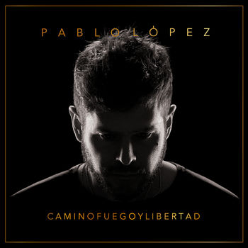

**Info**

- 🎤 Pablo López 
- 🎧 Camino, fuego y libertad
- 🎶 Lanzamiento: 15 diciembre 2017 
- Discográfica: Universal Music Spain
- Productor: Kim Fanlo

**Lista de canciones (tracklist)**

- [1. El camino](#1-el-camino)
- [2. El niño](#2-el-niño)
- [3. El gato](#3-el-gato)
- [El Patio](#el-patio)
- [La Dobleuve](#la-dobleuve)
- [El Incendio](#el-incendio)
- [El Teléfono](#el-teléfono)
- [Lo Imposible](#lo-imposible)
- [El Futuro](#el-futuro)
- [La Libertad](#la-libertad)
- [Las 17:00](#las-1700)
- [Otros discos](#otros-discos)
  - [Vi](#vi)
  - [Hijos del verbo amar](#hijos-del-verbo-amar)
  - [Te espero aquí](#te-espero-aquí)
  - [La mejor noche de mi vida](#la-mejor-noche-de-mi-vida)
  - [Lo saben mis zapatos](#lo-saben-mis-zapatos)
  - [Dos palabras](#dos-palabras)

# 1. El camino


**Intro**

| 1   | 2   | 3   | 4   |
| --- | --- | --- | --- |
| C   | Fm7 | C/E | Fm  |
| Dm7 | Eb  | Fm  | G   |

| 1   | 2   | 3   | 4   |
| --- | --- | --- | --- |
| Ab  | Fm  | C/E | C   |
| Ab  | Fm  | C/E | C   |


**Estrofa**
 
```
     Ab                      Fm                C
He llegado hasta aquí porque nunca dejé de buscarte
      Ab                   Fm                    C
He aprendido a vivir el camino y no quiero volver
     Am          Abdim         C/G           Abdim
Y tampoco quiero que me duelan los finales, las miserias,
F/A                    Fm/Ab
los idiotas enfadados, los abrazos de cartón
```

**Bridge**

``` 
   C Am      G   C           Am           G
De lejos te vi, de lejos me has hecho feliz.
```

**Estribillo**

``` 
F                                      Am
Y no quiero dejar de buscarte por este camino
F                                              Am    G
Te he contado que no te conozco y te quiero de leeejooos
```

| 1   | 2   | 3   | 4   |
| --- | --- | --- | --- |
| Ab  | Fm  | C/E | C   |
| Ab  | Fm  | C   | -   |

**Verse 2**

``` 
     Ab                F              C       C/E
Y te juro que vale la pena caer y romperse la cara
     Ab                     F                 C/E
Que regalo tan grande aprender de lo que nos dolió
     Am             Abdim/G#     C/G        D/F#
Que regalo estar en este viaje de románticos salvajes
F                     Fm/Ab
Soñadores desterrados caminantes del amor
``` 
**Bridge**
``` 
C     Am    G      C            Am    G
De lejos te vi, de lejos me has hecho feliz
``` 


**Estribillo**
``` 
F                                       Am
Y no quiero dejar de buscarte por este camino
F                                           Am         G
Te he contado que no te conozco y te quiero de lejos, de lejos
```
``` 

C       Am        G
Oooooooooooooooooooooooooooooooh
C       Am        G
Oooooooooooooooooooooooooooooooh (o algo así)
```
``` 
        F                          Am
Yo no quiero dejar de buscarte por este camino
         F                                  Am        G/B
Te he contado que no te conozco y te quiero de lejos, de lejos
``` 
**Outro**

| 1   | 2   | 3   | 4   |
| --- | --- | --- | --- |
| Ab  | Fm  | C/E | C   |
| Ab  | Fm  | Em  | -   |

```
    Ab         Fm              C/E           C
Te buscaré sin descansar, no dejaré de caminar
    Ab         Fm              C/E           C
Te buscaré sin descansar, no dejaré de caminar
    Ab         Fm              C/E           C
Te buscaré sin descansar, no dejaré de caminar
```

```
Ab                                 Bb            C/G
He llegado hasta aquí porque nunca dejé ... de buscarte
```
# 2. El niño

Los Em son G/E y Dm son F/D


**Intro**
```
Cm C Cm C
``` 
**Verse**
```
Am  G# C                         G          Am      Fm            C   
    Que tonta esta la vida, Que rapido se enfada, No me consiente nada
G                        C                     G           F
Ayer por la mañana apareciste por mi casa, Te lo llevaste todo
```
**Pre-estribillo**

```
G               Dm7      Em                      F
Sabias que no estaba. Sabi­as que era Martes, Sabi­as que Septiembre
```
**Estribillo**
``` 
G                Am     F        C            Am  F       C          G
Sabi­as todo como siempre,  Pero nadie me pregunta,  Nadie sabe como duele
              A#                 Am    G
Me han dejado solo, Entre tanta geeeenteee 
```
**Puente**
```
  Dm                        Em                      F    G
Y nada, nada, nada, nada, Nada, nada, nada, nada, Amooooooor
```
**Estrofa**

``` 
    G#             C           G           Am       G#            C
Por que siempre lo mismo, Por que tan evidente. Los sueños se resienten
G                  C     G#           C        G               F
El niño ya no sale de la puerta de su casa, Se lo han robado todo
```
**Pre-estribillo**
```
Dm                       Em                             F
Robaron sus zapatos, Su libertad, su abrigo Malditos enemigos
```

**Estribillo**

``` 
G                    Am     F        C            Am  F       C          G
Los malos pudieron contigo,  Pero nadie le pregunta,  Nadie sabe si le  duele
              A#                 Am    G
Lo han dejado solo, Entre tanta geeeenteee 
``` 

**Puente**

```
  Dm                        Em                      F    G
Y nada, nada, nada, nada, Nada, nada, nada, nada, Amooooooor
```
 
Dm C Em C F  G

**Estribillo**

``` 
       F          C            Am  F       C          G
Pero nadie le pregunta,  Nadie sabe si le  duele
              A#                 Am    G
Lo han dejado solo, Entre tanta geeeenteee 
``` 
**Puente**

```
  Dm                        Em                      F    
Y nada, nada, nada, nada, Nada, nada, nada, nada, Amooooooor
G     G#    C
Tu no sabes nada
```

**Final**

```
Am G# C F A# F C F
```

# 3. El gato

**Con guitarra**

Se puede tocar medio tono más abajo y poner cejilla en uno para hacerla más sencilla de tocar

**Intro**
```
Db - Gb - F - F - Bbm - Ab
``` 
**Estrofa**
```
   Db                                Abm                              Gb
Mi gato no tiene la culpa de tu cobardía,no tiene complejo de psicoanalista,
             Gbm            Db
no temas sus ojos Ni sus 7 vidas...
   Db                                  Abm                                  Ebm
Brillante,camina despacio Y esquiva gigantes,de extraña mirada,de salto elegante
                            A - Ab
Pequeño vestigio de fiera salvaje
         Bbm     Gb  Bbm         Gb          Bbm          Gb
Por eso dejalo,      No mendiga caricias, No precisa mi amor
             Db                  Ab - Db
Sabe de mi arañazo, De mi boca felina
``` 

**Pre-estribillo**

``` 
        A                  B                    A                       B
Yo te engaño, Te robo los días, Te ensucio las manos, Me escondo y me pierdo
               Gbm      E          B         A      Ab
Me vuelvo un extraño sin alma, Culpable que huye del sol
``` 
 
**Estribillo**
``` 
       Db                     Ab        F            Bbm
Y defendí tu vergüenza en los bares, dormí en los portales
          Gb             Db
Pise los pedazos de tu corazón
           Ab                      Db
Mi gato es mucho mejor persona que yo
```  

**Interudio**

```
Db - Gb - F - F - Bbm - Ab
```
 
**Estrofa**

```
   Db
Mi gato no quiere septiembres
               Abm
que engañen al mundo,no ahonda
                     Ebm
ciudades en comas profundos
 
no entiende de rabia;
            Ab - A
no mata por gusto
        Bbm   Gb
Asi que dejalo
Bbm             Gb
Que no mendiga caricias
Bbm          Gb
No precisa mi amor
             Db
Sabe de mi arañazo
             Ab - Db
De mi boca felina
``` 
**Puente**

``` 
        A                  B                    A                       B
Yo te engaño, Te robo los días, Te ensucio las manos, Me escondo y me pierdo
               Gbm      E          B         A      Ab
Me vuelvo un extraño sin alma, Culpable que huye del sol
``` 
**Estribillo**
``` 
       Db                     Ab        F            Bbm
Y defendí tu vergüenza en los bares, dormí en los portales
          Gb             Db
Pise los pedazos de tu corazón
           Ab                      Db
Mi gato es mucho mejor persona que yo
```  
``` 
Bbm - Fm - Gb x3 - Db
Ohhhhhhhhhhh!
```
 
**Estribillo**

``` 
       Db                     Ab        F            Bbm
Y me perdí tu vergüenza en los bares, dormí en los portales
          Gb             Db
Pise los pedazos de tu corazón
           Ab                      Db
Mi gato es mucho mejor persona que yo
```
``` 
Db - Gb - F - F - Eb - A - Ab - Db
``` 
(Final instrumental parecido a la intro)


# El Patio

Se puede subir medio tono y es más sencillo para guitarra. Habría que bajar la afinación medio tono en todas las cuerdas para coincidir con la original

**Intro**
```
ohhhhhh!!!~~** E - B - E
``` 
**Estrofa**
```
B                                    D#m
Fuera, vete de mi casa tú no eres mi amiga.
  E
Y yo sigo jugando que más da,sigo jugando solo.
    B                                      D#m
Me aburro,el patio está vacío y suena la sirena.
  E                                                       B5
Y yo sigo jugando qué más da,sigo jugando y siempre me castigas.
``` 
**Puente**
```
                   B5/A#
Solo quiero que te vayas,
                   B5/G#
solo quiero que se acabe,
                   E  F#  E  F#
solo quiero que me de-jes so-lo.
 ```
**Estribillo**
```
B5     B5/A#      B5/G#  B5/F#        E5
Fuera! Vete de mi casa,  suéltame las manos,
E5/D#             E5/C# E5/B            F#  E
no soy mas que un niño, con los pies descal-zos
  B               E          B            F# B
Y yo sigo jugando qué más da,sigo jugando so-lo.
``` 
**Instrumental**
 ```
B - E - B - E
 ```
**Estrofa**
```
B                               D#m
Nada,ya no queda nada,solo tu delirio,
   E
tu ruido insoportable en el salón,
                            B5
no queda nada más que tu fantasma.
 ```
**Puente**
```
                   B5/A#
Solo quiero que te vayas,
                   B5/G#
solo quiero que se acabe,
                   E  F#  E  F#
solo quiero que me de-jes so-lo.
 ```
**Estribillo**
 ```
B5     B5/A#      B5/G#  B5/F#        E5
Fuera! Vete de mi casa,  suéltame las manos,
E5/D#             E5/C# E5/B           F#   E
no soy mas que un niño, con los pies descal-zos
  B               E
Y yo sigo jugando qué más da,
E
 sigo jugando solo...
B                E
Yo sigo jugando, qué más da,
B             F# B      B*
 sigo jugando so-lo...
 ```
**CLÍMAX**
```
E
Solo
                      G#m
Siempre, siempre me castigas...
                       E
Siempre, siempre me castigas...

```
# La Dobleuve


**Intro**
```
 
F#m       C#     F#m
Se va, se va, se va
  C#m        D
Se va y no vuelve
 ```
**Estribillo**
 ```
F#m   C#m        D    E
uoooh ooooh uoooooh ooooh
F#m   C#m       D    E
uoooh ooooh uoooooh ooooh
 ```
**Verse**
 ```
Bm                      D
Sigo perdiendo las llaves
                 F#m
Perdiendo el teléfono
C#m
Perdiendome
 
Bm                 D
Sigo acumulando vida
             E
Huyendo del tiempo
Y de las despedidas
 
Bm                      D
Ahora q ya no me escuchas
             F#m
Que no te molesta mi
C#m
Despertador
Bm                   D
Ahora que no creo en nada
              E
Que no me atormenta despertar mañana
 ```
**Bridge**
 ```
F#m
Me dijiste
Bm                 F#m
Que lo que se va, no vuelve
Bm                F#m
Que lo que se va, se va
Bm                 F#m
Se va y no vuelve no
 ```
**Estribillo**
 ```
Bm    D              F#m         C#m
uoooh ooooh uoooo No vuelve, no vuelve
Bm    D              F#m         C#m
uoooh ooooh uoooo No vuelve, no vuelve
 
F#m C#m D E
 
F#m C#m D E
oooh oooh oooh oooh
 ```
**Verse**
 ```
Bm               D
Resucito cada viernes
             F#m      C#m
Y acabo el domingo desnudandote
Bm             D
Pobre fantasía loca
                 E
No hay vida ni olor
Debajo de tu ropa
 
Bm     F#m               E
Noooo, ooooh Solo queda una mitad
Bm    D          A       E
Uoooh Solo suena tu verdad
``` 
**Bridge**
 ```
F#m
Me dijiste
Bm                    F#m
Que lo que se va, no vuelve
D                    F#m
Que lo que se va, se va (me dijiste)
Bm               F#m
Se va y no vuelve no (que lo que se va)
 
F#m
Me juraste
C#
Que lo que se va
F#m                    C#
Duele tanto ver como se va
F#m                    C#
Alma, tiempo y vida que se va
F#m
No vuelve
 ```
**Estribillo**
 ```
Bm    D              F#m         C#m
uoooh ooooh uoooo No vuelve, no vuelve
Bm    D              F#m         C#m
uoooh ooooh uoooo No vuelve, no vuelve
Bm    D              F#m         C#m
uoooh ooooh uoooo No vuelve, no vuelve
Bm    D              F#m         C#m
uoooh ooooh
 ```
**Outro**
 ```
F#m   C#m              D         E
```
# El Incendio


**Intro**
``` 
F C# F C#
 ```
**Verse**
 ```
Fm        A#            Fm
Tengo tu mano en la espalda
   A#           C#
Tu abrazo que salva
   D#         Fm
Tu acorde mayor
 
Fm          A#         Fm
Fiel, Vengador, Homicida
    A#         C#
Brillante asesino
    Cm      A#
De tanto dolor
``` 
**Bridge**
``` 
F
Hoy he quemado
    Gm
Mi ropa y mi cama
 
Que bonito el incendio
        Dm
Cuando arde en las almas
 ```
**Estribillo**
 ```
   F         Am
Bendito el fuego
   A#      Dm  C    F
De mis hermaaa aaa  nooos
 ```
**Verse**
 ```
Fm        A#         Fm
Nos encontraron bailando
    A#        C#
Sobre las cenizas
   D#         Fm
De la discreción
 
Fm        A#         Fm
Ruido calla a la sonrisa
    A#        C#
Que baila, Mis amigos
    Cm      A#
Respiran canción
``` 
**Bridge**
 ```
F
Hoy me han echado
   A#
De todos los bares
Y que poco me importa
    Dm
Nos quedan mil calles
 ```
**Estribillo**
 ```
    F         Am
Que viva el fuego
   A#      Dm  C    F
De mis hermaaa aaa  nooos
 
G# C#
```
 
**Bridge**
 ```
F
Hoy he perdido
    Gm
100 años de vida
         A#
Y que hermoso el dolor
        B
De las dulces heridas
 ```
**Estribillo**
 ```
    F       Am
No mueras nunca
    A#
extraño humano
Dm           F                Bm
Que bonito es este incendio el mar
    F  C#
El manto
 ```
**Outro**
 ```
F C# F C#
```

# El Teléfono


**Intro**
``` 
A# G D
A# G D
 ```
**Verse**
 ```
        Bm           F#m         G
Quiero dejar de perdonarme cada día
        A                         D
Por desnudarme a volantazo cada noche
         Em    D                 A/C#
Por recordarte más de lo que debería
         G                         F#7
Por ser becario en la oficina del derroche
       Bm       F#m         G
Voy a dejar 40 velas encendidas
            A                          D
A ver si alguna me devuelve nuestro incendio
          Em          D          A/C#
No quiero más abrazos de tecnología
         G                      A
Ni tu silencio atragantado de color
``` 
**Estribillo**
 ```
       F#m    G
Esa noche   juré
             D
Que no lo haría
                 A            Bm
Y acabe con los dedos destrozados
        Bm        G              D
Soy más simple de lo que me creía
              A
Esta es la historia de
 
De un teléfono apagado
 ```
**Interlude**
 ```
A# G D
A# G D A
 ```
**Verse**
``` 
            Bm
Cuando escribí
          F#m       G
Aquel mensaje descarado
           A                      D
Manche de vino casi todas las palabras
           Em
Fui la vergüenza
       D           A/C#
Del poeta trasnochado
             G                         F#7
Y de los perros que no muerden lo que ladran
           Bm
No quiero azul
              F#m         G
No quiero en línea ni ocupado
            A                   D
No quiero móvil a las 6 de la mañana
             Em
Quiero que escuches
         D          A/C#
A este idiota equivocado
           G                      A
Y a su derrota de pantalla y cargador
 ```
 
**Estribillo**
 ```
       F#m    G
Esa noche   juré
             D
Que no lo haría
                 A            Bm
Y acabe con los dedos destrozados
                  G               D
Soy más simple de lo que me creía
               A
Esta es la historia de
 
De un teléfono apagado
 ```
**Interlude**
 ```
A# G Bm D
A# G A D
 ```
**Estribillo**
```
           G
Esa noche juré
               D
Que no lo haría
                 A    A#dim     Bm
Y acabe con los dedos destrozados
         G                D
Soy más pequeño de lo que creía
                    A
Esta es la historia de
 
De un teléfono apagado
``` 
**Outro**
``` 
A# G D A/C# Bm A
A# A G A
```

# Lo Imposible


**Estrofa**
 ```
D       Dsus4       D       Dsus4    D       Dsus4   D       Dsus4 
Fue tan improbable, tan imposible, tan difícil de explicar 
G       Gsus4       G      Gsus4    G         D               Em   A  
Donde esta el culpable, donde el pecado, la mentira, me da iguaaaaaal
          D     Dsus4   D           G           D/F#           Em    A
Es una historia despeinada, Una derrota en el teléfono, en la caaamaaa
    
 ```
**Bridge**
 ```
D              A/C#
Yo no sé disimular
E                      G
Ni esconderme entre la gente
Gm             Bm
Tú pareces tan valiente
G              D
Tan cansada de esperar
 ```
 
**Estribillo**
 ```
Bm           A         G
Diles que se vayan por favor
D                  A/C#
Diles que se vayan todos
C                    G
Y si no te escuchan, déjalos
Gm
Hace rato ya que estamos
Bm A D
Solos
 ```
**Verse 2**
 ```
D       Dsus4   D
Falta de coraje
Dsus4   D
Y como siempre la maldita vanidad
Dsus4   D Dsus4   D
 
G       Gsus4       G
Besos sin tatuaje
D
París sin luz
Em
Nuestro Madrid sin Alcalá
 
A          D     Dsus4   D
No te esperaba aquella tarde
G
Tan de repente
D/F#
Tan abrazo
Em       A
Tan gigante
``` 
 
**Bridge**
``` 
D              A/C#
Y yo no sé disimular
E                      G
Ni esconderme entre la gente
Gm             Bm
Tú pareces tan valiente
G              D
Tan cansada de esperar
 ```
 
**Estribillo**
``` 
Bm           A         G
Diles que se vayan por favor
D                  A/C#
Diles que se vayan todos
C                    G
Y si no te escuchan, déjalos
Gm
Hace rato ya que estamos
 ```
**Solo**
```
Bm A D
 ```
 
**Estribillo**
 ```
Bm           A         G
Diles que se vayan por favor
D                  A/C#
Diles que se vayan todos
C                    G
Y si no te escuchan, déjalos
Gm
Hace rato ya que estamos
Bm A D
Solos
```

# El Futuro

Capo 1

**Estrofa**
```
G
No te despiertes con el futuro, quizá haya telefono y mal café
G                  F             G             F
No te castigues pequeña con el futuroooooooooooooo
G                  F         G                       F
Quiero vivirte desconectado, que no nos cuenten los besos por esta vez
G                   F              F          G
Que no se entere tu dios de mis pecadooooooooooooos
```
**Pre-coro**
```
Am       C       D#    Dm     Dm       Am        G
Volveeereeeé, seremos libres, seremos tierra y animal
G                              G
Volveré y seremos invisibles, como aquella tarde gris de abril
```
```
Em     D      C       Bm          D
Tus caras cobaaardes, si saben de miii
G
Y el tesoro quedó en nubes de tormenta, ruido en la memoria de la piel
Em      D      C      Bm        D
No les tengo miedo, vidas de papel
```
**Pre-coro**
```
Am       C       D#    Dm     Dm       Am        G
Volveeereeeé, seremos libres, seremos tierra y animal
Am           C      D#    Dm    Dm        Am            G
Yo te encontré, salvaje y triste, como la luz en tu ciudad
```
**Instrumental**
```
Am | C | G | F
Am | C | G | F

G F | Em D# | A# Dm
Am G...
```

``` 
G
No me preguntes por el futuro, no me preguntes por el futuro, porque
Em      D      C    Bm          D
no les tengo miedo, vidas de papel
```
**Pre-coro**
```
Am       C       D#    Dm     Dm       Am        G
Volveeereeeé, seremos libres, seremos tierra y animal
Am       C       D#    Dm     Dm       Am               G
Yo te encontré, salvaje y triste, como la luz en tu ciudad
Volveré
Volveré
```
**Final**
```
G | G | G | G x4
F Em
```

# La Libertad

Capo 3

**Estrofa**
```
C                                                   Dm
Deja de mirar con tanto ruido, de bailar sobre mis tejas
                                                    F
De decir que esta prohibido, mientras saltas por la reja
                      Fm                             C
De jurar que yo no he sido, de esconder la mano, dejaaa

C                                                       Dm
Deja que te cuente los motivos,  de sentarme entre tus piernas
                                           F
De sentirme fugitivo, cada vez que me despiertas
              Fm
De la siesta por castigo, no quiero escucharte
C                    G
Deja, deja, Deja, uoooh
```
**Estribillo**
```
C      G     C    F     G       Am
Santa libertad, muéstrame el camino
C      G#    C  Am   Em     G        F    G    C
Dame una razón, para pensar que sigo viiiiiivoooo
```
**Estribillo**
```
  C                                                       Dm
Y deja, que me vista la vergüenza, que me esconda en el lavabo
                                             F
Que me cure la tristeza, que disfrute mis pecados
                   Fm                    C
Que me rinda la belleza, de vivir equivocado

C                                                   Dm
Y deja, que lloremos el futuro, que contemos otra historia
                     2prevF
que la nuestra te lo juro, se ha quedado en la memoria
                      Fm                  C
que pequeño es este mundo, deja de escucharme
C                    G
Deja, deja, Deja, uoooh
```
**Estribillo**
```
C      G     C    F     G       Am
Santa libertad, muéstrame el camino
C      G#    C  Am   Em     G        F    G    C
Dame una razón, para pensar que sigo viiiiiivoooo
```
# Las 17:00

**Estrofa**
``` 
E
No quería dejar de llamar a la puerta de la tentación
                   C#m
que me invita al desastre.
 E
No podía dejar de buscar el piano
                               G#
de aquella canción que jamás me cantaste.
``` 
**Estribillo**
``` 
A                                    C#m
17 00 de un reloj desesperado. Son las 5 de la tarde
 
y no tengo la intención de
G#m                    B                    E C#m
terminar. Yo no quiero que me cuenten el final.
 ```
**Verse 2**
 ```
E
No podía dejar de buscar el piano de
                          G#
aquella canción que jamás me cantaste
``` 
**Estribillo**
 ```
A                                   C#m
17 00 de un reloj desesperado. Son las 5 de la tarde y no tengo
                  C
la intención de terminar
            E            B
esta noche no. Yo no quiero que me cuenten el final.
 ```
**Bridge**
 ```
E Em C Em D# Gm D
 ```
**Estribillo**
``` 
C                                   Em
17 00 de un reloj desesperado. Son las 5 de la tarde
 
y no tengo la intención de
  Bm
terminar.
 
Yo no quiero que me cuentes el final.
 ```
**Outro**
 ```
C#m A Cm Em B E
```

# Otros discos

## Vi

**Intro (arpegiando)**
```
 G  Eb (Bis)
 ```
**Estrofa**
```
Gm                      F                        Eb     Eb-F
Reza en este verso todo lo que en esta vida he guardado
Gm                      F                     Eb
sirva como humilde testamento de un hermoso legado.
```
**Pre-coro**
```
Gm        Eb      Bb     F     Gm       Eb      Bb          F
Dejé el amor detrás de ti, dejé el valor perdido en escenarios
```
**Estrofa**
```
Gm           F         Eb           Eb-F
Vi morir mi sueño, vi como resucitaba,
       Gm             F            Eb
vi los ojos de la envidia, vi canciones, vi palabras.
     Gm                 F/A      Cm
Dime si hoy se acaba el mundo corazón,
                  E     F
dime qué vas a llevarte, dime que me llevo yo.
```
**Estrofa**
```
Gm | F |  Eb7 | - x2
  ```
**Estrofa**
```
Gm                         F             Eb        Eb-F
Tengo la tranquilidad de haber vivido días y noches,
Gm                      F              Eb
he bañado en vino madrugadas, he besado el derroche.
Gm       Eb      Bb     D7/Gb      Gm     Eb       Bb       F
Me emocioné cantando al sooool, perdí, gané, crecí con la batalla.
Gm            F              Eb                Eb-F
Vi el engaño, vi algunas verdades, vi que estamos solos,
Gm            F          Eb
vi fortunas, vi necesidades, vi quemarse todo.

 ```
**Estrofa**
```
Gm               F/A        Cm                  Eb        F
Si hoy se acaba el mundo corazón, dime qué vas a llevarte, dime que me llevo...
```
**Estribillo**
```
Gm             F          Eb                   Eb-F
Vi llorar a un alma inconsolable, vi reír al miedo,
Gm             F                Eb
vi besar, yo he visto amar, he visto cuanto debo.
     Gm                 F/A      Cm
Dime si hoy se acaba el mundo corazón,
            Dm     Eb   F
dime qué vas a llevarte, dime que me llevo yo.
 ```
Final 1 
```
Gm | - | Eb | - x2
```
Final 2 (arpegiando)
```
Gm | - | Eb | - x2
``` 


## Hijos del verbo amar
```
[Intro]
 
G#m E C#   x2
 
[Verse]
 
G#m                      F#                 G#m                            C#
Dos animales de verbo salvaje, de abrazo mortal, de brillante y maldito linaje
C#m          G#m             B               F#                  C#m
Bajo la lluvia van caminando, están tan vivos, han renovado su piel
              G#m          E                   B                     D#
Y en este mundo envenenado, van engañando al dios que hay bajo sus pies
 
[Chorus]
 
E                   B   F#                G#m         E
Nadie les calla la boca, nadie conoce de sus heridas,
                  B        F#
maleta y rumbo directo al sol
E                   B  F#                     G#m      F#
Han incendiado la ropa, ya han aprendido a bailar la vida
E                    B     C#      D#              G#m
Que no les roben su libertad, son hijos del verbo amar
 
[Solo]
 
G#m E C#   x2
 
[Verse]
 
G#m                                               F#
Carne bendecida por la tierra, larga vida a los amantes locos
G#m                                                    D#m
Grita el pecho su canción de guerra, viva esta revolución
                A                G#m            B
Y que viva el amor de los que besan desesperados
                F#                 C#m                 G#m              E
Por si esta luna fuera la ultima vez, que sobre el libro de los pecados
             B                 D#
Juraron olvidar al miedo a perder
 
[Chorus]
 
E                   B  F#                 G#m         E
Nadie les calla la boca, nadie conoce de sus heridas,
                  B        F#
maleta y rumbo directo al sol
E                  B   F#                     G#m     F#
Han incendiado la ropa, ya han aprendido a bailar la vida
E                    B    C#       D#               C#
Que no les roben su libertad, son hijos del verbo amar
 
[Solo]
 
C#   G#m   B   F#   
A   G#m   G#m/D#   D#
 
[Chorus]
 
E                   B   F#               G#m       F#
Nadie les calla la boca, nadie conoce de sus heridas,
E                 B        F#
maleta y rumbo directo al sol
E                  B  D#/G                      G#m      F#
Han incendiado la ropa, y han aprendido a bailar la vida
E                    B    C#      D#               G#m
Que no les roben su libertad, son hijos del verbo amar
 ```
**Final**
``` 
G#m | E | C#/G#  |-
G#m | E/G# | C#7/G# | - 
G#m
```

## Te espero aquí

**Guitarra**
- Subiéndola un semitono es más fácil de tocar, y se puede desafinar la guitarra medio tono para coincidir con la canción


Arpegiar Intro -
 
**Intro**
```
F# Bm/F# F# Bm/F#
 
[Verse]
G#m                Ebm
No entiendo como fue
                    A#m
Como llegue hasta aquella habitación
B          G#m               Ebm   C#
Caminando fui besando tus palabras
  B                 C#
Mirando al suelo, no te esperaba...
G#m                Ebm
  Extraña la emoción
             A#m
Extraña la manera de sentir
B             G#m
Dos extraños mas
              Ebm       C#
Comiendose hasta el alma
B                   C#
Mordiendo el aire me he despertado y...
 
```
**Estribillo**
```
              Gb   Abm   Gb/Bb             B 
Tengo que decirte,   que nunca pierdo el sueño por 
       Gb   Abm   Gb/Bb           B                Db
cualquiera,   que se quedo en mi pecho lo que hiciste
    Bbm7                  Ebm    Db   B        Db   
Que no debi­ bajar esa escalera. Solo quiero volver a
 Gb   Abm   Gb/Bb        B 
 verte, Y despejar las dudas que me
 Gb    Abm  Gb/Bb        B            Db
 quedan, No se si te abrace lo suficiente
  Bbm                       Ebm
O nos ganó la prisa traicionera
  Db     B    Bm/D    Gb
Vuelve, yo te espero aqui...
```
**Instrumental (arpegiar)**
``` 
 
F# Bm/D F# Bm/D

 
[Verse]
G#m                 Ebm
   No se si fuiste tu
              A#m
Probablemente fueramos los dos
B        G#m                      Ebm C#
Olvidamos que el mundo sigue ahi fuera
 B               C#
Amenazando nuestra cancion...
 
G#m               Ebm
   Esclavo de reloj
              A#m
Tuve que separarme de tu piel
B           G#m
Aunque mi calor
               Ebm C#
Nunca dejo esa cama
    B                 C#
Yo sigo en ella, sigo abrazando y...
 
```
**Estribillo**
```
              Gb   Abm   Gb/Bb             B 
Tengo que decirte,   que nunca pierdo el sueño por 
       Gb   Abm   Gb/Bb           B                Db
cualquiera,   que se quedo en mi pecho lo que hiciste
    Bbm7                  Ebm    Db   B        Db   
Que no debi­ bajar esa escalera. Solo quiero volver a
 Gb   Abm   Gb/Bb        B 
 verte, Y despejar las dudas que me
 Gb    Abm  Gb/Bb        B            Db
 quedan, No se si te abrace lo suficiente
  Bbm                       Ebm
O nos ganó la prisa traicionera
  Db     B        
Vuelve, yo 
 
```
**Estribillo**
```
 Bm/D        Gb   Abm   Gb/Bb             B 
Tengo que decirte,   que nunca pierdo el sueño por 
       Gb   Abm   Gb/Bb           B                Db
cualquiera,   que se quedo en mi pecho lo que hiciste
    Bbm7                  Ebm    Db   B        Db   
Que no debi­ bajar esa escalera. Solo quiero volver a
 Gb   Abm   Gb/Bb        B 
 verte, Y despejar las dudas que me
 Gb    Abm  Gb/Bb        B            Db
 quedan, No se si te abrace lo suficiente
  Bbm                       Ebm
O nos ganó la prisa traicionera
  Db     B    Bm/D    Gb
Vuelve, yo te espero aqui...
 
B       C#        F#
yo te espero aqui...
 
[Outro] (Arpegiar)
F# Bm/D
F# Bm/D
```

## La mejor noche de mi vida

**Intro** 

| 1    | 2      | 3   | 4      |
| ---- | ------ | --- | ------ |
| A    | F#m    | C#m | F#m    |
| A    | F#m Bm | F#m | E      |
| A    | B      | F#m | E      |
| A/C# | D      | F#m | C#m/G# |
 

**Estrofa** 
``` 
Bm               A
Entre la felicidad
                 F#m
Y la desesperación
                       E
La carretera es muy corta
D            F#m
Necesitaba salir
                    A
Romper con todo y vivir
                        E
Que lo demás ya no importa
 
Bm               A
Como unos locos sin fe
               F#m
Salimos a pelear
                  E
Contra la melancolía
D            F#m
Besamos la libertad
                    A
Nos abrazamos a todo
                 E
lo que nos sonreía
```

**Pre-estribillo**
 ```
     Bm    F#m     E     D           Bm    F#m     E
Como niños sin preocupación, Como el ave que escapó...
```
**Estribillo** 
``` 
A                Bm                   A/C#                   D
Creo que por una vez, Conseguimos no ser los esclavos de nadie
         A/E                 C#/F      F#m           E/G#
Nos perdonamos las viejas heridas. Así fue, la mejor noche de mi vida
       A                Bm                 A/C#          D
Sin palabras, Fuimos al mar y abrazamos el alba Nos olvidamos
               A/E            C#/F   F#m           E/G#
de lo que nos falta. Hoy juraría que fue, La mejor noche de mi vida...
```
**Instrumental** 
``` 
Bm F#m | E D | Bm F#m | E
```
**Estrofa** 
``` 
Bm               A
Que te podría contar
                 F#m
No entiendo como pasó
                 E
Pero tocamos la gloria
D                 F#m
Nos escondimos de Dios
                  A
Nos regalamos al sol
                    E
Todo quedó en la memoria
 
Bm               A
La noche se terminó
                 F#m
Pero yo sigo luchando
               E
Por comerme el mundo
D                   F#m
Quién sabe cuando podré
                       A
Cantarle a cielo otra vez
                  E
Con ese grito profundo
 
```
**Pre-estribillo**
 ```
     Bm    F#m     E     D           Bm    F#m     E
Como niños sin preocupación, Como el ave que escapó...
```
**Estribillo** 
``` 
A                Bm                   A/C#                   D
Creo que por una vez, Conseguimos no ser los esclavos de nadie
         A/E                 C#/F      F#m           E/G#
Nos perdonamos las viejas heridas. Así fue, la mejor noche de mi vida
       A                Bm                 A/C#          D
Sin palabras, Fuimos al mar y abrazamos el alba Nos olvidamos
               A/E            C#/F   F#m           E/G#
de lo que nos falta. Hoy juraría que fue, La mejor noche de mi vida...
A                Bm                   A/C#                   D
Creo que por una vez, Conseguimos no ser los esclavos de nadie
         A/E                 C#/F      F#m           E/G#
Nos perdonamos las viejas heridas. Así fue, la mejor noche de mi vida
       A                Bm                 A/C#          D
Sin palabras, Fuimos al mar y abrazamos el alba Nos olvidamos
               A/E            C#/F   F#m           E/G#
de lo que nos falta. Hoy juraría que fue, La mejor noche de mi vida...
 
[Outro]
 
A    D     A/C#  D
A/E  C#/F  F#m   E/G#
```
## Lo saben mis zapatos
```
Intro]
C Bm/F# Em Bm
C Bm/F# Em7
 
[Verse]
C/E           Bm/F#        C/E         Bm/D
 No quiero correr, lo saben mis zapatos
C/E           Bm/F#        C/E         Bm/D
 No quiero pedir, lo saben los ingratos
Em              Bm7       C          G   D/F#
  Quiero que aparezcas,    quiero verte cerca,
Em            G/B      Dsus4     D
  Quiero merendarte al sol.
 
[Verse]
C/E           Bm/F#        C/E         Bm/D
 Quiero pelear,   lo saben los cobardes
C/E           Bm/F#        C/E         Bm/D
 Quiero celebrar, lo saben los que arden
Em               Bm7   C             G   D/F#
 No quiero olvidarme,   no quiero escaparme,
Em             Bm7     Dsus4         D
 No quiero pensar que fue un delirio,
 
[Chorus]
G      Cm/G    G
Yooooooooooooooo   te quiero
   D                 Em    C            G
matar, y no lo sabe nadie, no lo sabe nadie
            D        Em    C
Te quiero matar de amor y no,
            G      Am7     G/B     C        Em   D    G
No lo sabe nadie, nadie, naaadie puede imaginár  se   lo.
 
[Instrumental]
C Bm/F# Em Bm
C Bm/F# Em7
 
[Verse]
C/E           Bm/F#        C/E         Bm/D
 No quiero volar,   lo saben mis amigos
C/E           Bm/F#        C/E         Bm/D
 No quiero bailar,  lo saben los testigos
Em              Bm7     C             G   D/F#
 Quiero que me abras,    quiero tus palabras
Em              Bm      Dsus4      D
 Quiero que lo quieras hoy.
 
[Verse]
C/E           Bm/F#        C/E         Bm/D
Quiero hacer sentir,  lo saben estas manos
C/E         Bm/F#      C/E         Bm/D
Quiero repartir,   lo saben los humanos
         Em            D      C           G
No quiero perderte, no quiero soñarte
         Em              Bm      D      D
No quiero escribirte   más historias.
 
[Chorus]
G      Cm/G    G
Yooooooooooooooo   te quiero
   D                 Em    C            G
matar, y no lo sabe nadie, no lo sabe nadie
            D        Em    C
Te quiero matar de amor y no,
            G      Am7     G/B     C        Em   D    G
No lo sabe nadie, nadie, naaadie puede imaginár  se   lo.
 
[Instrumental]
C Bm/F# Em Bm
C Bm/F# Em7
 
[Chorus]
G      Cm/G    G
Yooooooooooooooo   te quiero
   D                 Em    C            G
matar, y no lo sabe nadie, no lo sabe nadie
            D        Em    C
Te quiero matar de amor y no,
            G      Am7     G/B     C        Em   D    G
No lo sabe nadie, nadie, naaadie puede imaginár  se   lo.
 
[Outro]
C Bm/F# Em Bm
C Bm/F# Em7
```
## Dos palabras
```
[Intro]
 
A A7  A6 A7
A A7  A6 A7
 
 
[Verse 1]
 
A          A7            A          A7
Todo acabó deprisa, se congeló la brisa
Bm             E7
Fueron dos palabras
Bm             E7
Fueron dos palabras
 
A          A7
No dijo nada extraño
A          A7
No quiso hacerme daño
Bm             E7     Bm             E7
Pero el miedo pesa, más que la razón
 
[Chorus]
 
D          E7      F#m     C#m
Y yo, que soy un perro que no tiene dueño
D          E7      F#m     C#m
Me escapé, corrí como un niño pequeño
D          E7      F#m     C#m
Recordé que a veces el mundo va en serio
D
Fueron dos palabras
Dm            A
Fueron dos palabras

A | A 
 
[Verse 2]
 
A          A7            A          A7
Quisimos evitarlo, quizás disimularlo
Bm           E7  Bm             E7
Éramos cobardes, solo dos cobardes
 
A          A7
Culpables e inocentes
A          A7
De sueños diferentes
Bm           E7  Bm             E7
Pero se perdonaban hasta la verdad
 
 
[Chorus]
 
D          E7      F#m     C#m
Tú jamás pensaste que me lo dirías
D          E7      F#m     C#m
Pero yo callé más de lo que debía
D          E7      F#m     C#m
Nos cegó la luz de aquel último día
D
Fueron dos palabras
D            E
Fueron dos palabras
 ```
| 1   | 2   | 3   | 4      |
| --- | --- | --- | ------ |
| Bm7 | F#m | A/E | B7     |
| Bm7 | F#m | A/E | E A/C# |
 ```
[Chorus]
 
D          E7      F#m     C#m
Y yo, que soy un perro que no tiene dueño
D          E7      F#m     C#m
Me escapé, corrí como un niño pequeño
D          E7      F#m     C#m
Recordé que a veces el mundo va en serio
D
Fueron dos palabras
Dm               A
Fueron dos palabras
 
[Outro]
 
A A7  A6 A7
A A7  A6 A7
```
## Tu enemigo
```
[Intro]
D# Cm Gm A#  Cm A# F
 
[Verse]
Gm
Bajo sombra he visto otra montaña bebiendo sin permiso de otro río
A#                             F   Cm       Gm
Alimentando al monstruo de la rabia. Tu enemigo
Gm
Quién viene a tu país a profanarte, quién pisa la ciudad sin tu permiso
A#                            F   Cm       Gm
Quién sacará tus cosas de la calle. Tu enemigo
 
[Chorus]
           D#                             Gm
Si estos idiotas supieran que yo soy el hombre
                    A#                      F
más rico del mundo así, viviendo de tus abrazos
     Cm                                  Gm
Olvidaron que el hombre no es más que un hombre
    A#                   F           D7                        Gm
Que tus manos son mi bandera y que tengo de frontera una canción
 
Gm
No me preguntes para qué he venido, pregúntate mejor cómo has llegado
A#                               F Cm          Gm
Puede que seas el hijo de algún hijo de un esclavo
Gm                              D#
Ven y háblame da frente a tu enemigo
                   F            Gm
(ven y háblame de frente a tu enemigo)
Gm                            D#
Culpable del amor trabajo y tierra
                F              A#
(culpable del amor trabajo y tierra)
A#                         F  Cm        D#      F
Culpable de vivir en el camino por tu guerra  aaah
 
[Chorus]
            D#                            Gm
Si estos idiotas supieran que yo soy el hombre
                   A#                      F
más rico del mundo así, viviendo de tus abrazos
     Cm                                  Gm
Olvidaron que el hombre no es más que un hombre
    A#                   F           D7                        D#
Que tus manos son mi bandera y que tengo de frontera una canción
 
[Interlude]
D#  Cm  Gm
Dm D#
Cm  A#  F
Cm  A#  F
 
[Chorus]
           D#                             Gm
Si estos idiotas supieran que yo soy el hombre
                    A#                      F
más rico del mundo así, viviendo de tus abrazos
     Cm                                  Gm
Olvidaron que el hombre no es más que un hombre
    A#                   F           D7                        Gm
Que tus manos son mi bandera y que tengo de frontera una canción
 
[Outro]
 D#       F           Gm
She le le le le le ...  una canción
 D#       F      Gm
   No no no no no no no no ...
 D#       F      Gm
Te le le le le le...  una canción
```